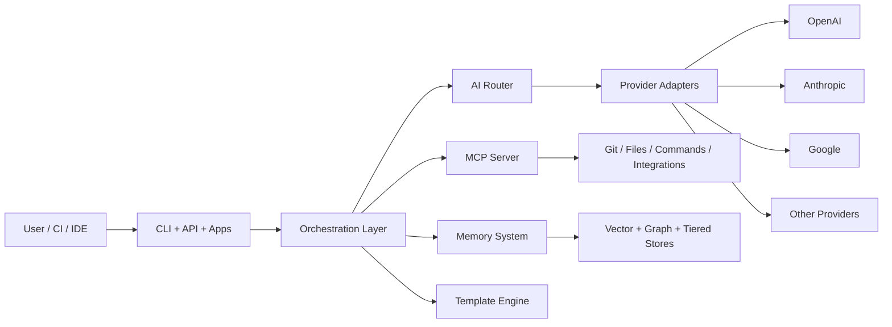

# Ultra-Dex v6.0.0

> The AI orchestration meta-layer for production software delivery.

[](https://github.com/Srujan0798/Ultra-Dex)
[](LICENSE)
[](https://nodejs.org/)

Ultra-Dex is a **control plane for AI-assisted engineering**. It coordinates agents, model providers, memory, and tool execution so teams can go from prompt to deployable output with stronger reliability than single-agent workflows.

## What Ultra-Dex Is

- **Provider-agnostic orchestration**: route requests across OpenAI, Anthropic, Google, Mistral, Groq, DeepSeek, Cohere, Together, Fireworks, Perplexity, and more.
- **Agent execution runtime**: planner/coder/reviewer-style workflows with governance and verification hooks.
- **Memory-aware system**: tiered memory + retrieval components for longer-running tasks.
- **Tool-connected platform**: CLI, MCP server, plugins, extensions, and app surfaces.

## One-Command Install

```bash
npx ultra-dex init
```

## 5-Minute Quickstart

### 1) Bootstrap

```bash
npx ultra-dex init "Build a SaaS backend with auth + billing"
```

### 2) Configure providers

```bash
npx ultra-dex config --wizard
```

### 3) Run an orchestrated workflow

```bash
npx ultra-dex run --task "Implement user onboarding flow"
```

### 4) Check quality gates

```bash
npx ultra-dex verify --live
```

### 5) Track state

```bash
npx ultra-dex status
```

## Feature Matrix

| Capability          | What it does                                                      | Status |
| ------------------- | ----------------------------------------------------------------- | ------ |
| Agent Orchestration | Multi-agent execution with delegated tasks and sequencing         | Ready  |
| AI Routing          | Strategy-based provider selection (cost/latency/quality/fallback) | Ready  |
| Provider Layer      | Unified adapters for major hosted/local model providers           | Ready  |
| Memory              | Tiered memory + retrieval utilities for persistent context        | Ready  |
| MCP                 | MCP server mode with memory + agent status tools                  | Ready  |
| CLI Runtime         | Large command surface for build/plan/review/ops workflows         | Ready  |
| Dashboard & Apps    | Dashboard, cloud/web/desktop/docs app workspaces                  | Ready  |
| SDK                 | Programmatic SDK for providers, agents, and plugins               | Ready  |

## Architecture Overview



## Why It Exists

Most AI coding stacks are strong at short sessions and weak at sustained delivery. Ultra-Dex exists to close that gap:

- It keeps long-running work coherent across agents and tools.
- It separates **execution policy** (orchestration) from **model vendor** (providers).
- It gives teams a skeleton to extend, not a cage that locks them in.

**Philosophy:** _Skeleton, not a cage._

## Repository Layout

- `apps/cli` - core command runtime
- `src/core` - orchestration, AI routing, memory, MCP, templates
- `src/services/ai-providers` - 10 unified provider adapters
- `apps/dashboard` - operator UI
- `apps/cloud`, `apps/web`, `apps/desktop`, `apps/docs-site` - platform apps
- `packages/sdk` - public JS/TS SDK
- `packages/plugins`, `packages/extensions`, `packages/cursor-rules` - ecosystem

## SDK Example

```js
import { UltraDex } from '@ultra-dex/sdk/client';
import { BaseProvider } from '@ultra-dex/sdk/provider';

class MockProvider extends BaseProvider {
  async chat(messages) {
    return {
      content: messages.at(-1)?.content ?? '',
      usage: { inputTokens: 1, outputTokens: 1, totalTokens: 2 },
      model: 'mock-v1',
    };
  }

  async *stream() {
    yield { type: 'done' };
  }

  async embed() {
    return { embedding: [0.1, 0.2, 0.3], dimensions: 3 };
  }
}

const sdk = new UltraDex({ defaultProvider: 'mock' });
sdk.registerProvider('mock', new MockProvider());

const response = await sdk.chat([{ role: 'user', content: 'Draft release notes' }]);
console.log(response.content);
```

## Development

```bash
git clone https://github.com/Srujan0798/Ultra-Dex.git
cd Ultra-Dex
npm install
npm test
```

## Governance and Compliance

- Code of conduct: `CODE_OF_CONDUCT.md`
- Security reporting: `SECURITY.md`
- Commit/PR legal and policy checks: `gitFail/compliance/GITHUB_COMPLIANCE_CHECKLIST.md`
- Local compliance validation: `node gitFail/compliance/check-governance-files.js`

## License

MIT. See `LICENSE`.
