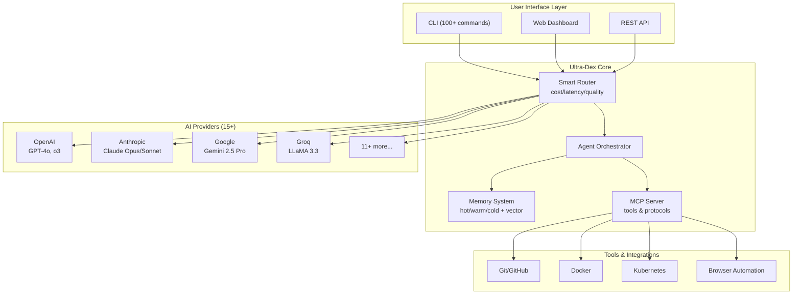

# Ultra-Dex v6.0.0 🚀

> **The AI Orchestration Meta-Layer for SaaS Development**
>
> One system. Any AI provider. Infinite possibilities.

[](https://github.com/Srujan0798/Ultra-Dex)
[](LICENSE)
[](https://nodejs.org/)

---

## 🎯 What is Ultra-Dex?

Ultra-Dex is the **meta-layer that orchestrates ANY AI tool** into a cohesive, autonomous development system. Think of it as the conductor for your AI orchestra—coordinating multiple AI agents, providers, and tools to deliver production-ready software.

### Core Philosophy: _Skeleton, Not a Cage_

We provide the structure (the skeleton) that holds everything together, but we don't lock you in (the cage). Ultra-Dex is:

- **Provider-agnostic**: Use OpenAI, Anthropic, Google, Groq, or 11+ other providers
- **Tool-agnostic**: Integrate with any MCP-compatible tool or API
- **Framework-agnostic**: Works with React, Vue, Angular, or vanilla JS
- **Deployment-agnostic**: Deploy anywhere—Vercel, AWS, Docker, or on-premise

---

## ⚡ One-Command Install

```bash
npx ultra-dex init
```

That's it. Ultra-Dex will:

- Set up your project structure
- Configure default providers
- Initialize the memory system
- Create your first agent blueprint

---

## 🚀 5-Minute Quickstart

### 1. Initialize a Project (30 seconds)

```bash
# Create a new project blueprint
npx ultra-dex init "Build a real-time chat app with authentication"

# Or clone and run locally
git clone https://github.com/Srujan0798/Ultra-Dex.git
cd Ultra-Dex
npm install
```

### 2. Configure Providers (1 minute)

```bash
# Set your API keys (optional - mock mode works too!)
export OPENAI_API_KEY="sk-..."
export ANTHROPIC_API_KEY="sk-ant-..."

# Or use the interactive config
npx ultra-dex config --interactive
```

### 3. Run Your First Agent (2 minutes)

```bash
# Launch the CLI
npm start

# Initialize with a task
npm start -- init "Create a landing page with Tailwind CSS"

# Watch the orchestration happen
npm start -- run architect --verbose
```

### 4. Deploy (1.5 minutes)

```bash
# Build and verify
npm start -- verify --live

# Deploy to your target
npm start -- deploy --platform=vercel
```

---

## ✨ Feature Matrix

| Feature                   | Description                                                  | Status   |
| ------------------------- | ------------------------------------------------------------ | -------- |
| **🤖 Multi-Agent System** | 15+ specialized agents (architect, coder, reviewer, planner) | ✅ Ready |
| **🧠 Smart Routing**      | Auto-select best AI provider based on cost/latency/quality   | ✅ Ready |
| **💾 Persistent Memory**  | 3-tier memory (hot/warm/cold) with vector search             | ✅ Ready |
| **🔧 MCP Integration**    | Native Model Context Protocol support                        | ✅ Ready |
| **🛡️ Verification Gates** | Automated quality checks and security scans                  | ✅ Ready |
| **📊 Dashboard**          | Real-time monitoring and agent visualization                 | ✅ Ready |
| **🎮 CLI Interface**      | 100+ commands for complete control                           | ✅ Ready |
| **🔄 Git Integration**    | Auto-commit, PR generation, branch management                | ✅ Ready |
| **📱 Multi-Platform**     | Web, mobile, desktop, and cloud apps                         | ✅ Ready |
| **🏪 Plugin Marketplace** | Extensible plugin architecture                               | ✅ Ready |

---

## 🏗️ Architecture Overview



### Component Details

1. **CLI Layer** (`apps/cli`)
   - Interactive command interface
   - 100+ commands for development workflows
   - Real-time agent monitoring

2. **Smart Router** (`src/core/ai`)
   - Provider-agnostic routing
   - Cost optimization
   - Latency-based selection
   - Automatic fallbacks

3. **Agent Orchestrator** (`src/core/orchestration`)
   - Multi-agent coordination
   - Task decomposition
   - State management
   - Workflow automation

4. **Memory System** (`src/core/memory`)
   - Hot tier: Recent conversations
   - Warm tier: Important decisions
   - Cold tier: Archived knowledge
   - Vector search: Semantic retrieval

5. **MCP Server** (`src/core/mcp`)
   - Tool execution
   - Protocol handlers
   - Host integrations
   - Extensible architecture

---

## 🎨 Why Ultra-Dex Exists

Most AI coding tools fail at scale because they:

- ❌ **Lose context** across long tasks
- ❌ **Can't coordinate** multiple specialized agents
- ❌ **Have weak guardrails** for quality and security
- ❌ **Lock you in** to specific providers or frameworks
- ❌ **Don't verify** their outputs actually work

Ultra-Dex solves this by combining:

- ✅ **Persistent memory** that survives across sessions
- ✅ **Multi-agent orchestration** with specialized roles
- ✅ **Built-in verification** gates and quality checks
- ✅ **Provider flexibility** - use any AI, switch anytime
- ✅ **End-to-end delivery** from idea to deployed code

---

## 📦 What's Included

### Core Runtime

- **15 AI Provider Adapters**: OpenAI, Anthropic, Google, Mistral, Groq, DeepSeek, and more
- **Smart Routing**: Cost/latency/quality-based provider selection
- **Memory System**: 3-tier storage with vector search
- **Agent Orchestrator**: Multi-agent coordination and workflow management

### Applications

- **CLI** (`apps/cli`): 100+ commands for complete development workflow
- **Dashboard** (`apps/dashboard`): Real-time monitoring and visualization
- **Cloud** (`apps/cloud`): Serverless deployment platform
- **Web** (`apps/web`): Web interface for agent management
- **Desktop** (`apps/desktop`): Electron-based desktop app
- **Docs** (`apps/docs-site`): Documentation site

### Packages

- **SDK** (`packages/sdk`): JavaScript/TypeScript SDK
- **Plugins** (`packages/plugins`): Extensible plugin system
- **Extensions**: VSCode, Cursor, and other editor extensions

---

## 🔧 Advanced Usage

### Custom Agent Workflows

```bash
# Create a custom agent swarm
npx ultra-dex swarm --config ./my-swarm.json

# Define custom verification gates
npx ultra-dex verify --config ./quality-gates.yaml

# Run with specific providers only
npx ultra-dex run --providers=openai,anthropic
```

### Programmatic API

```javascript
import { UltraDex } from '@ultra-dex/sdk';

const ultra = new UltraDex({
  providers: ['openai', 'anthropic'],
  strategy: 'cost',
});

const result = await ultra.run({
  agent: 'architect',
  task: 'Design a scalable API',
});
```

---

## 🌍 Community & Support

- **GitHub Issues**: [Report bugs or request features](https://github.com/Srujan0798/Ultra-Dex/issues)
- **Discussions**: [Join the community](https://github.com/Srujan0798/Ultra-Dex/discussions)
- **Documentation**: [Full docs](https://ultra-dex.ai/docs)
- **Twitter**: [@UltraDexAI](https://twitter.com/UltraDexAI)

---

## 📄 License

MIT License - see [LICENSE](LICENSE) file for details.

---

## 🙏 Acknowledgments

Ultra-Dex stands on the shoulders of giants:

- OpenAI, Anthropic, Google, and all AI providers
- The Model Context Protocol (MCP) community
- Contributors and early adopters

---

> _"The future of software development is not AI replacing humans—it's AI empowering humans to build what was previously impossible."_
>
> — Ultra-Dex Team

**Ready to build?** `npx ultra-dex init`
