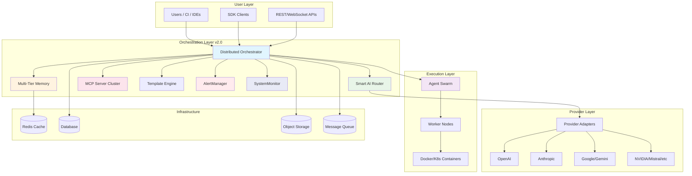

# Ultra-Dex v2.0.0

> The AI orchestration meta-layer for production software delivery.

[](https://github.com/Srujan0798/Ultra-Dex)
[](LICENSE)
[](https://nodejs.org/)
[](tsconfig.json)

Ultra-Dex is the **connective tissue between AI models, memory, and tools**. It serves as a "Meta-Layer" that coordinates agents, model providers, memory, and tool execution so teams can go from prompt to deployable output with stronger reliability than single-agent workflows.

Canonical references:
- `docs/PROJECT_STRUCTURE.md`
- `docs/AGENT_INTEGRATION_GUIDE.md`

## What Ultra-Dex Is

- **Provider-agnostic orchestration**: route requests across OpenAI, Anthropic, Google, Mistral, Groq, DeepSeek, Cohere, Together, Fireworks, Perplexity, and more.
- **Agent execution runtime**: planner/coder/reviewer-style workflows with governance and verification hooks.
- **Memory-aware system**: tiered memory + retrieval components for longer-running tasks.
- **Tool-connected platform**: CLI, MCP server, plugins, extensions, and app surfaces.
- **Enterprise-grade security**: pre-commit hooks, secret scanning, strict TypeScript, sandboxed execution.

## One-Command Install

```bash
npx ultra-dex init
```

## 5-Minute Quickstart

### 1) Bootstrap

```bash
npx ultra-dex init "Build a SaaS backend with auth + billing"
```

### 2) Configure providers

```bash
npx ultra-dex config --wizard
```

Fast path (NVIDIA Nemotron):

```bash
export NVIDIA_API_KEY=nvapi-your-key
export ULTRA_DEX_DEFAULT_PROVIDER=nvidia
```

### 3) Run an orchestrated workflow

```bash
npx ultra-dex run --task "Implement user onboarding flow"
```

### 4) Check quality gates

```bash
npx ultra-dex verify --live
```

### 5) Track state

```bash
npx ultra-dex status
```

### 6) Open Interactive Dashboard

```bash
npx ultra-dex dashboard
```

## Interactive Features

Ultra-Dex includes a terminal-first interactive layer for orchestration and project inspection.

- **Omni-Box Entry Point**: Launch the interactive dashboard with `npx ultra-dex dashboard`. Use `--once` for a single snapshot, `--json` for machine-readable output, or `--web` for the browser dashboard.
- **Natural Language Processing**: 60+ intent mappings with semantic understanding for agents, development, quality, project, and integration tasks
- **Interactive Terminal & Web Dashboard**: Terminal dashboard with `ultra-dex dashboard`, web dashboard with `--web --port`, and JSON output with `--json`
- **Themed Logger System**: JSON-capable logger with success/info/error levels
- **"Did you mean?" Typo Correction**: Automatic suggestion for mistyped commands like `buid` → `build"
- **Recent Projects and Quick Actions**: The dashboard surfaces recent workspaces, command shortcuts, and system health in one place.
- **System Doctor**: Run diagnostics and repair workflows from the CLI when you need a fast health check.

For the implementation details and usage notes, see [docs/INTERFACE.md](docs/INTERFACE.md).

## Feature Matrix

| Capability | What it does | Status |
|------------|--------------|--------|
| Agent Orchestration | Multi-agent execution with delegated tasks and sequencing | ✅ Ready |
| AI Routing | Strategy-based provider selection (cost/latency/quality/fallback) | ✅ Ready |
| Provider Layer | Unified adapters for major hosted/local model providers | ✅ Ready |
| Memory | Tiered memory + retrieval utilities for persistent context | ✅ Ready |
| MCP | MCP server mode with memory + agent status tools | ✅ Ready |
| CLI Runtime | Large command surface for build/plan/review/ops workflows | ✅ Ready |
| Dashboard & Apps | Dashboard, cloud/web/desktop/docs app workspaces | ✅ Ready |
| SDK | Programmatic SDK for providers, agents, and plugins | ✅ Ready |
| Performance | Advanced caching, LRU eviction, and Redis integration | ✅ Enhanced |
| Resilience | Timeout handling, fallback mechanisms, and error recovery | ✅ Enhanced |
| Security | Pre-commit hooks, secret scanning, strict TypeScript | ✅ Enterprise |
| Monitoring | AlertManager, HealthChecker, MetricsReporter | ✅ Enterprise |

## v2.0 Architecture Overview

Ultra-Dex v2.0 introduces a distributed orchestration platform with enhanced scalability, multi-tenancy, and enterprise-grade resilience:



## Cycle 1: Enterprise Hardening ✅

**Completed:** Security, TypeScript strict mode, timeouts, monitoring, and comprehensive testing.

### Security & Compliance
- ✅ Pre-commit hooks for secret scanning (blocks API keys, tokens)
- ✅ `.env` file protection in `.gitignore`
- ✅ Removed default passwords from docker-compose files
- ✅ tar >=7.5.11 vulnerability patched
- ✅ CodeQL security analysis workflow

### TypeScript Strict Mode
- ✅ `noImplicitAny: true` enabled
- ✅ 210+ files type-safe
- ✅ All error handlers properly typed (`Error | unknown`)
- ✅ Module declarations for all npm packages

### Resilience & Timeouts
- ✅ **RALPH Loop**: Configurable `maxExecutionTimeMs` (default 5min)
- ✅ **MCP Auto-start**: 5-second timeout with graceful degradation
- ✅ **Self-healing triggers**: Automatic failover on agent failures

### Monitoring & Observability
- ✅ **AlertManager**: Centralized alerting with severity levels
- ✅ **HealthChecker**: System health monitoring
- ✅ **MetricsReporter**: Performance metrics collection
- ✅ **EngagementTracker**: Usage analytics

### Testing
- ✅ **40+ unit tests** across core modules
- ✅ **21 integration tests** (orchestration, memory, AI routing)
- ✅ **12 timeout-specific tests**
- ✅ **c8 coverage** tooling integrated

## The 30-Cycle Roadmap

Development follows a 30-cycle roadmap divided into three phases:

- **Phase 1: Foundation** (Cycles 1-10) - Core infrastructure and basic functionality ✅ Cycle 1 Complete
- **Phase 2: Growth & Ecosystem** (Cycles 11-20) - SDK, dashboard, marketplace, workflows
- **Phase 3: Enterprise & Scale** (Cycles 21-30) - Multi-tenancy, cloud IDE, fine-tuning, deployment

## Why It Exists

Most AI coding stacks are strong at short sessions and weak at sustained delivery. Ultra-Dex exists to close that gap:

- It keeps long-running work coherent across agents and tools.
- It separates **execution policy** (orchestration) from **model vendor** (providers).
- It gives teams a skeleton to extend, not a cage that locks them in.

**Philosophy:** _Skeleton, not a cage._

## Repository Layout

- `apps/cli` - core command runtime
- `src/core` - orchestration, AI routing, memory, MCP, templates
- `src/services/ai-providers` - 10+ unified provider adapters
- `src/services/auth` - Enterprise authentication (SSO, MFA, JWT)
- `src/monitoring` - AlertManager, HealthChecker, MetricsReporter
- `apps/dashboard` - operator UI
- `apps/cloud`, `apps/web`, `apps/desktop`, `apps/docs-site` - platform apps
- `packages/sdk` - public JS/TS SDK
- `packages/plugins`, `packages/extensions`, `packages/cursor-rules` - ecosystem
- `config/` - Deployment configs (Docker, K8s, nginx)

## Project Organization

This repository follows a well-organized structure to separate concerns:

- `docs/` - All documentation including legal, process, planning, reports, specs, and testing guides
  - `docs/legal/` - Legal documents (LICENSE, CODE_OF_CONDUCT.md, SECURITY.md)
  - `docs/process/` - Process documents and quality assessments
  - `docs/planning/` - Planning documents and launch strategies
  - `docs/reports/` - Completion reports and certificates
  - `docs/specs/` - Technical specifications
  - `docs/investors/` - Investor relations materials
  - `docs/testing/` - Test reports and testing documentation
- `config/` - Configuration files organized by type
  - `config/deploy/` - Deployment configurations (Dockerfile, docker-compose.yml)
  - `config/k8s-deployment.yaml` - Kubernetes deployment manifests
  - `config/runtime/` - Runtime configs (nginx, docker-compose.prod.yml)
  - `config/linting/` - Linting configurations (.markdownlint.json, etc.)
  - `config/testing/` - Testing configurations (vitest.config.js)
  - `config/project/` - Project-specific configurations (.ultra-dex.json, mcp-config.json)
- `scripts/` - Utility scripts
  - `scripts/build-cli.sh` - CLI build script
  - `scripts/coverage-report.js` - Coverage reporting
- `business/` - Business-related operations and materials
  - `business/operations/` - Operations, strategy, team building, customer research, scaling, launch activities
  - `business/finance/` - Financial planning, fundraising, investment preparation
  - `business/marketing/` - Marketing, PR, press materials
  - `business/investors/` - Investor relations and materials
  - `business/legal/` - Legal documents and compliance
- `logs/` - Log files and temporary logs
  - `logs/temporary/` - Temporary log files and test outputs

## Developer Experience

Ultra-Dex prioritizes developer experience with interactive tutorials and comprehensive documentation:

```bash
# Interactive learning experience
npx ultra-dex learn

# Quick setup wizard
npx ultra-dex config --wizard

# Pre-built agent templates
npx ultra-dex agents create --template=coder
npx ultra-dex agents create --template=writer
npx ultra-dex agents create --template=researcher

# Run tests
npm test
npm run test:coverage
npm run test:integration

# Build all components
npm run build
```

## SDK Example

```js
import { UltraDex } from '@ultra-dex/sdk/client';
import { BaseProvider } from '@ultra-dex/sdk/provider';

class MockProvider extends BaseProvider {
  async chat(messages) {
    return {
      content: messages.at(-1)?.content ?? '',
      usage: { inputTokens: 1, outputTokens: 1, totalTokens: 2 },
      model: 'mock-v1',
    };
  }

  async *stream() {
    yield { type: 'done' };
  }

  async embed() {
    return { embedding: [0.1, 0.2, 0.3], dimensions: 3 };
  }
}

const sdk = new UltraDex({ defaultProvider: 'mock' });
sdk.registerProvider('mock', new MockProvider());

const response = await sdk.chat([{ role: 'user', content: 'Draft release notes' }]);
console.log(response.content);
```

## Development

```bash
git clone https://github.com/Srujan0798/Ultra-Dex.git
cd Ultra-Dex
npm install
npm test
```

## Testing

```bash
# Run all tests
npm test

# Run with coverage
npm run test:coverage

# Run integration tests only
npm run test:integration

# Run specific test file
npm test -- tests/core/ralph-timeout.test.js
```

## Security & Governance

- **Code of conduct**: `CODE_OF_CONDUCT.md`
- **Security reporting**: `SECURITY.md`
- **Secret scanning**: Pre-commit hooks block API keys and tokens
- **Compliance checks**: `node gitFail/compliance/check-governance-files.js`
- **TypeScript strict mode**: `noImplicitAny: true` prevents runtime type errors

## License

MIT. See `LICENSE`.
