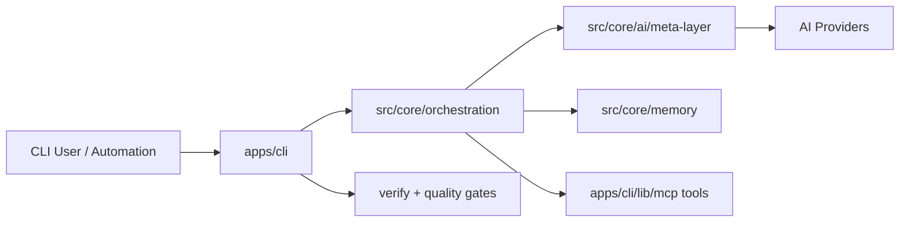

# Ultra-Dex v6.0.0

Ultra-Dex is an AI orchestration runtime for software delivery: multi-agent planning, execution, verification, and memory in one system.

## Why Ultra-Dex Exists

Most AI coding workflows fail at scale for the same reasons:

- no durable context across long tasks
- no orchestration between specialized agents
- weak guardrails for quality and security
- no reliable path from idea to verified output

Ultra-Dex exists to solve that by combining:

- an orchestration brain (`src/core/orchestration`)
- a provider-agnostic AI meta-layer (`src/core/ai`)
- persistent tiered memory (`src/core/memory`)
- executable verification gates (`verify`, Protocol 21, quality hooks)
- MCP-native tool surfaces for local and remote operations

## What’s in v6.0.0

- Agent orchestration core with autonomous Nexus workflow support.
- Multi-provider routing and fallback across `OpenAI`, `Anthropic`, `Google`, `Ollama`, `Azure`, and `mock`.
- CLI-first runtime with large command surface in `apps/cli`.
- MCP server/tooling stack for tool execution and host integrations.
- Monorepo apps for dashboard, docs, web, mobile, desktop, cloud, and white-label.

## Installation

Ultra-Dex is currently run from source in this monorepo.

### Prerequisites

- Node.js `>=18.0.0`
- npm `>=8.0.0`

### Setup

```bash
git clone https://github.com/Srujan0798/Ultra-Dex.git
cd Ultra-Dex
npm install
```

Optional environment setup:

```bash
cp .env.example .env.local
```

Provider keys (optional but recommended):

- `OPENAI_API_KEY`
- `ANTHROPIC_API_KEY`
- `GOOGLE_API_KEY`

Local mock mode:

- `MOCK_AI=true`

## Quickstart

All commands below are run from repo root.

```bash
# launch CLI
npm start

# initialize a project blueprint
npm start -- init "Build a SaaS analytics dashboard"

# inspect available agents
npm start -- agents list

# run a specialized agent task
npm start -- run planner -t "Break this objective into atomic tasks"

# run autonomous swarm/orchestration
npm start -- swarm "Implement user onboarding with auth + billing"

# run verification gates
npm start -- verify --live
```

## Architecture

Ultra-Dex is organized as layered runtime components, not a single monolith:

- Interface Layer: `apps/cli` command runtime and user workflows.
- Orchestration Layer: `src/core/orchestration` for task routing, scheduling, coordination, sessions.
- AI Meta-Layer: `src/core/ai/ai-meta-layer.js` for provider selection, fallback, caching, monitoring.
- Memory Layer: `src/core/memory` (hot/warm/cold tiering via SQLite provider).
- Tooling Layer: `apps/cli/lib/mcp` for MCP server, tools, protocol handlers, and host mode.
- Verification Layer: `apps/cli/lib/commands/verify.js` and quality hooks/protocol gates.



## Repository Structure

- `apps/cli`: CLI entrypoint, commands, MCP, providers, templates, assets.
- `src/core`: orchestration, agents, AI layer, memory, protocols, scaffolding.
- `apps/dashboard`: Vite/React dashboard UI.
- `apps/docs-site`: Docusaurus docs site.
- `apps/web`, `apps/mobile`, `apps/desktop`, `apps/cloud`, `apps/white-label`: platform surfaces.
- `packages/*`: shared packages/extensions.
- `tests/*`: core/integration/CLI/performance tests.

## Development

```bash
# run tests
npm test

# lint + type checks
npm run lint
npm run typecheck

# full build pipeline
npm run build
```

`npm run build` executes `build:core`, `build:dashboard`, and `build:docs`.
`build:docs` has a fallback message when Docusaurus binaries are unavailable in the current environment.

## Design Principles

- Orchestrate first: treat AI as a system of cooperating specialists.
- Verify always: enforce quality/security gates before “done.”
- Preserve memory: keep durable, queryable context across sessions.
- Stay provider-flexible: avoid lock-in with a stable meta-layer contract.

## License

MIT (`LICENSE`)
