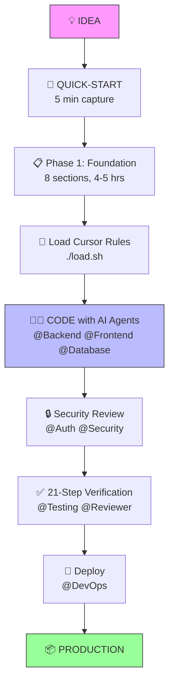

# Ultra-Dex

[](https://www.npmjs.com/package/ultra-dex)
[](https://github.com/Srujan0798/Ultra-Dex/actions/workflows/ci.yml)
[](https://opensource.org/licenses/MIT)
[](./CONTRIBUTING.md)
[](./@%20Ultra%20DeX/Saas%20plan/04-Imp-Template.md)
[](./@%20Ultra%20DeX/Saas%20plan/Examples/TaskFlow-Complete.md)
[](./cursor-rules/)
[](./agents/)
[](./cli/)

> **From Idea to Full-Scale, Production-Ready Application**


---

## 🧠 Core Philosophy: "Your Skeleton, Not Your Cage"

Ultra-Dex is a **meta-orchestration layer** - it doesn't write code for you, it makes your AI assistants dramatically smarter by giving them structure, memory, and architectural context.

| Principle | What It Means |
|-----------|---------------|
| ✅ **AI-Agnostic** | Works with Claude, GPT, Gemini, Cursor, Copilot |
| ✅ **Comprehensive by Design** | 34 sections prevent "forgot to plan X" syndrome |
| ✅ **100% Flexible** | Add, remove, modify any section to fit your needs |
| ✅ **Production-Grade** | Not for MVPs - for real, scalable applications |

### Is Ultra-Dex Right for You?

| ✅ YES if... | ❌ NO if... |
|-------------|-------------|
| Building production SaaS with AI assistants | Just testing an idea or weekend prototype |
| Want structured AI orchestration | Prefer ad-hoc prompting |
| Need architectural memory across sessions | Working on simple scripts |
| Building with a team | Solo on a tiny project |

---

## 🚀 NEW: Ultra-Dex v3.3.0 (Professional Purple Edition with Advanced Monitoring)

**The Meta-Orchestration Layer for AI Development**

Ultra-Dex v3.3.0 introduces **Advanced Monitoring & Observability**, comprehensive error recovery, and enhanced developer experience features alongside the Professional Purple Theme and multi-agent orchestration.

```bash
# Run autonomous agent swarms with parallel execution
npx ultra-dex swarm "Build user authentication" --parallel

# Start the Active Kernel (MCP + WebSocket + Dashboard)
npx ultra-dex serve

# Generate editor configuration
npx ultra-dex config --cursor --vscode

# Auto-update state on file changes
npx ultra-dex watch --interval 1000

# Check system status and health
npx ultra-dex status --all

# Manage configuration interactively
npx ultra-dex config --wizard

# Monitor system metrics
npx ultra-dex metrics
```

**42+ commands. Autonomous agents. MCP integration. Advanced monitoring. Modern Professional UI.**

Works with Claude, OpenAI, or Gemini. [Set your API key →](#ai-commands)

---

## ✨ v3.3.0 Feature Highlights

- **Advanced Monitoring & Observability** - Comprehensive logging, metrics collection, and health monitoring with `ultra-dex status`, `ultra-dex metrics`, and `ultra-dex health` commands.
- **Intelligent Error Recovery** - Circuit breaker patterns, automatic retry mechanisms, and graceful degradation with `ultra-dex debug` for detailed diagnostics.
- **Enhanced Configuration Management** - Interactive configuration wizard, environment variable overrides, and persistent settings with `ultra-dex config --wizard`.
- **Professional Purple Theme** - Clean indigo-to-pink gradient interface for high-performance development. [See Theme Guide](./docs/CLI-THEME.md).
- **Unified Active Kernel** - One process serves MCP, dashboard, REST API, and WebSocket streaming (`ultra-dex serve`).
- **Graph-Augmented Swarms** - Agents receive a Code Property Graph (CPG) context for structural reasoning.
- **Executable Verification** - `ultra-dex verify` runs the 21-Step framework on any task.
- **Self-Healing CI** - `ultra-dex ci-monitor` listens to CI failures and triggers AI-assisted fixes.
- **Autonomous Implementation** - `ultra-dex auto-implement "feature"` handles plan → code → verify.
- **Live Dashboard** - Agent status, timeline, and quality signals in real time.

---

## 📦 Installation

```bash
npm install -g ultra-dex
```

Or run without installing:

```bash
npx ultra-dex --help
```

**Requirements:** Node.js 18+ and Git.

---

## 🔌 MCP Integration Quick Start

1. Start the Active Kernel:
   ```bash
   npx ultra-dex serve
   ```
2. Generate Claude Desktop MCP config:
   ```bash
   npx ultra-dex config --mcp
   ```
3. Open Claude Desktop, reload MCP servers, and connect to the project.

Full guide: **[docs/MCP-INTEGRATION.md](./docs/MCP-INTEGRATION.md)**.

---

## 🆚 VS Code Extension Usage

The Ultra-Dex VS Code extension provides sidebar agent browsing, alignment checks, and quick actions.

```bash
cd vscode-extension
npm install
npm run compile
```

- Press `F5` to launch the Extension Development Host.
- Run **Ultra-Dex: Select Agent** from the command palette.

Local-only extension (not published). More: **[vscode-extension/README.md](./vscode-extension/README.md)**.

---

## 🛠️ CI/CD Setup

1. Install local pre-commit gate:
   ```bash
   npx ultra-dex pre-commit --install
   ```
2. Add GitHub Actions workflow (alignment + validation + export).

Full guide: **[docs/CICD-GUIDE.md](./docs/CICD-GUIDE.md)**.

---

## What is Ultra-Dex?

A comprehensive framework for building complete, production-grade applications. **This is not for MVPs or quick prototypes** — it is a rigorous system for engineering full-scale software with:

- **34-section Implementation Template** - Covers every aspect of a production application
- **21-Step Verification Framework** - Strict quality gates for every atomic task
- **Atomic Task Methodology** - 4-9 hour tasks with realistic estimates
- **AI Agent Instructions** - Prompts for Claude, GPT, Gemini
- **Modular Cursor Rules** - AI-optimized rules for Cursor, Copilot
- **17 Production-Ready AI Agents** - CTO, Backend, Frontend, Database, Auth, DevOps, Reviewer, Debugger, Planner, Testing, Performance, Security, Refactoring, Research, Documentation, Orchestrator, Specialist
- **Multi-Tool Orchestration** - Coordinate Claude Code + Cursor + Copilot + ChatGPT + Gemini together

---

## Quick Start (One Path)

| Step | What | Time |
|------|------|------|
| 1 | **[QUICK-START.md](./@%20Ultra%20DeX/Saas%20plan/01-QUICK-START.md)** — Capture your idea | 5 min |
| 2 | **[HOW-TO-USE.md](./@%20Ultra%20DeX/Saas%20plan/02-HOW-TO-USE.md)** — Understand phasing | 10 min |
| 3 | **[BUILD-AUTH-30M.md](./docs/BUILD-AUTH-30M.md)** — Your first working feature | 30 min |
| 4 | **Start coding with AI agents** | ∞ |

**That's it.** After step 3, you have working auth and understand the system.

<details>
<summary>📚 Full resources (when you need them)</summary>

| Resource | Purpose |
|----------|---------|
| [Full Template](./@%20Ultra%20DeX/Saas%20plan/04-Imp-Template.md) | 34-section reference |
| [TaskFlow Example](./@%20Ultra%20DeX/Saas%20plan/Examples/TaskFlow-Complete.md) | See a filled example |
| [Methodology](./@%20Ultra%20DeX/Saas%20plan/03-METHODOLOGY.md) | 21-step verification system |
| [Cursor Rules](./cursor-rules/) | AI-optimized rules |
| [Agent Prompts](./agents/) | 16 specialized agents |
| [All Guides](./guides/) | Database, architecture, orchestration |
| [CEO Master Plan](./docs/CEO-MASTER-PLAN.md) | Release status and next milestones |

</details>

---

## 🤔 Is Ultra-Dex Right for You?

**✅ USE Ultra-Dex if:**
- Building a SaaS with users, auth, payments
- Complex data model (5+ database tables)
- Team of 2+ developers OR solo with 3+ month timeline
- Targeting production users, not just a demo

**❌ DON'T use Ultra-Dex if:**
- Static website / blog
- Simple CRUD app (<3 features)
- Weekend hackathon project
- Solo dev with <1 month timeline

---

## 🚀 First Win: Auth in 30 Minutes

**Don't read everything first.** Build something.

```bash
npx ultra-dex init         # Creates your project skeleton
```

Then follow **[BUILD-AUTH-30M.md](./docs/BUILD-AUTH-30M.md)** — you'll have:
- Working login/logout
- Protected routes
- User session management
- Understanding of the Ultra-Dex workflow

> **Offline-ready:** CLI bundles agents, rules, and docs. Use `npx ultra-dex fetch` only if you want a separate offline cache.

**After that?** You'll know if Ultra-Dex fits your project.

---

## 🗺️ The Ultra-Dex Flow



**The Meta-Layer Philosophy:**
- Ultra-Dex doesn't write code — it provides **structure & memory** for AI agents
- Each agent (@CTO, @Backend, etc.) has context about YOUR project
- The 34-section template is YOUR project's "single source of truth"

---

## 💻 CLI Quick Start

```bash
npx ultra-dex init
```

**This generates:**
```
your-project/
├── QUICK-START.md         ← Your idea captured
├── CONTEXT.md             ← Project context for AI
├── IMPLEMENTATION-PLAN.md ← Starter sections
├── docs/
│   ├── CHECKLIST.md       ← 21-step verification
│   └── AI-PROMPTS.md      ← Agent instructions
├── .cursor/rules/         ← (optional) Cursor AI rules
└── .github/copilot-instructions.md ← (optional) Copilot rules
```

**CLI Commands (42+):**
```bash
# Setup & Planning
npx ultra-dex init
npx ultra-dex generate "idea"
npx ultra-dex examples

# Agents
npx ultra-dex agents
npx ultra-dex agent backend

# Build & Review
npx ultra-dex build
npx ultra-dex review
npx ultra-dex align

# Project Checks
npx ultra-dex audit
npx ultra-dex validate

# Monitoring & Health
npx ultra-dex status              # Show system status
npx ultra-dex status --all       # Show all system info
npx ultra-dex metrics            # Show performance metrics
npx ultra-dex health             # Check system health
npx ultra-dex debug              # Show detailed debug info

# Configuration Management
npx ultra-dex config             # Show configuration
npx ultra-dex config --wizard    # Interactive configuration
npx ultra-dex config --list      # List all settings
npx ultra-dex config --get key   # Get specific setting
npx ultra-dex config --set key=value  # Set specific setting

# MCP & Automation
npx ultra-dex serve
npx ultra-dex hooks
npx ultra-dex fetch
npx ultra-dex sync

# Guides
npx ultra-dex workflow auth
npx ultra-dex suggest
```

---

## <a name="ai-commands"></a>🤖 AI Commands Setup

Set your API key to use AI-powered features:

```bash
# Option 1: Claude (Recommended)
export ANTHROPIC_API_KEY=your-key

# Option 2: OpenAI
export OPENAI_API_KEY=your-key

# Option 3: Google Gemini
export GOOGLE_AI_KEY=your-key
```

Then use:

```bash
# Generate complete 34-section plan
npx ultra-dex generate "A task management SaaS for remote teams"

# Preview without calling AI
npx ultra-dex generate "idea" --dry-run

# Use different provider
npx ultra-dex generate "idea" --provider openai
```

**Sample Output:**
```text
$ npx ultra-dex build
🔧 Ultra-Dex Build Mode

✓ Context loaded
? Select an agent: (Use arrow keys)
  ── Leadership ──
❯ 📋 @Planner - Break down tasks
  🏗️  @CTO - Architecture decisions
  ── Development ──
  ⚙️  @Backend - API endpoints
  🎨 @Frontend - UI components
  ...

$ npx ultra-dex review --quick
📁 Project Structure:
📁 src/
  📁 app/
  📁 components/
📄 package.json
...

📋 Quick Checks:
  ✅ IMPLEMENTATION-PLAN.md
  ✅ CONTEXT.md
  ✅ package.json
  ❌ Database schema
```

---

## Folder Structure

```
Ultra-Dex/
├── README.md                      ← You are here
├── docs/                          ← Documentation & guides
│   ├── ROADMAP.md, VISION-V2.md   (Strategy)
│   ├── MCP-INTEGRATION.md         (Claude/Cursor Setup)
│   ├── CICD-GUIDE.md              (GitHub Actions)
│   ├── QUICK-REFERENCE.md         (Cheatsheet)
│   └── TROUBLESHOOTING.md         (Common issues)
├── agents/                        ← 16 AI agents (tier-based)
│   ├── 1-leadership/              (CTO, Planner, Research)
│   ├── 2-development/             (Backend, Frontend, Database)
│   ├── 3-security/                (Auth, Security)
│   ├── 4-devops/                  (DevOps)
│   ├── 5-quality/                 (Reviewer, Debugger, Testing, Documentation)
│   ├── 6-specialist/              (Performance, Refactoring)
│   └── 00-AGENT_INDEX.md          ← Quick reference table
│
├── guides/                        ← Production guides
│   ├── PROJECT-ORCHESTRATION.md   ← Multi-agent workflows
│   ├── DATABASE-DECISION-FRAMEWORK.md ← Database selection guide
│   ├── ARCHITECTURE-PATTERNS.md   ← Architecture patterns
│   ├── ADVANCED-WORKFLOWS.md      ← Real workflow examples
│   ├── MULTI-TOOL-WORKFLOW.md     ← Coordinate multiple AI tools
│   └── AI-MODEL-SELECTION.md      ← Choose the right AI model
│
├── Orchestration/                 ← Orchestration examples
│   ├── Copilot.md, Devin.md, gemini.md
│   └── EXAMPLES.md, README.md
├── cursor-rules/                  ← Modular AI rules
│   ├── 00-ultra-dex-core.mdc
│   ├── 01-database.mdc
│   ├── 02-api.mdc
│   └── ... (13 domain-specific rules)
│
└── @ Ultra DeX/
    └── Saas plan/
        │
        │  # Core (numbered for order)
        ├── 00-README.md           ← Navigation hub
        ├── 01-QUICK-START.md      ← 5-minute entry point
        ├── 02-HOW-TO-USE.md       ← Phased approach & workflows
        ├── 03-METHODOLOGY.md      ← 21-step system explained
        ├── 04-Imp-Template.md     ← Full 34-section template (5,500 lines)
        │
        ├── Examples/              ← Complete filled examples
        │   ├── TaskFlow-Complete.md
        │   ├── InvoiceFlow-Complete.md
        │   └── HabitStack-Complete.md
        │
        └── Templates/             ← Supplementary templates
            ├── 01-CONTEXT-TEMPLATE.md
            ├── 02-STATUS-TEMPLATE.md
            ├── 03-CONSTRAINTS-TEMPLATE.md
            ├── 04-INTEGRATIONS-TEMPLATE.md
            ├── 05-CHANGELOG-TEMPLATE.md
            ├── 06-SaaS-Workflow.md
            └── 07-Rule-Book-21.md
```

---

## The Pipeline

```
💡 IDEA
    ↓
📋 QUICK-START (5 minutes)
    ↓
📝 FULL TEMPLATE (34 sections)
    ↓
✅ 21-STEP VERIFICATION (per task)
    ↓
🚀 PRODUCTION-READY
```

---

## Template Sections (34 Total)

| Part | Sections | Coverage |
|------|----------|----------|
| **Product** | 1-10 | Definition, Tech Stack, Database, API, Auth, Frontend, Real-time, Payments, UI/UX, Testing |
| **Operations** | 11-20 | Deployment, Errors, Logging, Performance, Security, Tasks, Timeline, Risks, Maintenance, Launch |
| **Advanced** | 21-34 | Docs, Roadmap, Accessibility, Cost, Analytics, Error Strategy, Legal, SEO, i18n, Feature Flags, Real-time Architecture, Support, AI/ML |

---

## The Ultra-Dex Difference

| Other Templates | Ultra-Dex |
|-----------------|-----------|
| Product definition only | Product → Code → Deploy |
| Vague tasks | 4-9 hour atomic tasks |
| No verification | 21-step checklist |
| Optimistic estimates | Overhead calculation (+25% testing, +10% review) |
| "Done when shipped" | Production-ready definition |

---

## 🦴 Core Philosophy: Your Skeleton, Not Your Cage

**Ultra-Dex is a backbone, not a straitjacket.**

### The Problem Ultra-Dex Solves

When working with AI agents (Claude, GPT, Gemini, Copilot, etc.), you've likely experienced this:

1. You start with a clear plan
2. A few conversations later, you're deep in some tangent
3. The AI forgets the main architecture
4. You waste tokens re-explaining context
5. You lose the structured path you started with

**Ultra-Dex prevents this.** It gives every AI a shared, transparent structure to follow.

### How It Works

```
┌─────────────────────────────────────────────────────────┐
│  YOUR IDEA  +  ANY AI/LLM  +  ULTRA-DEX STRUCTURE      │
│                      ↓                                  │
│            STRUCTURED IMPLEMENTATION PLAN               │
│                      ↓                                  │
│            PRODUCTION-READY APPLICATION                 │
└─────────────────────────────────────────────────────────┘
```

### Key Principles

| Principle | What It Means |
|-----------|---------------|
| **Use ANY AI** | Claude, GPT, Gemini, Copilot, local LLMs — your choice |
| **100% Flexible** | Add sections, remove sections, modify anything |
| **You Own the Plan** | The AI fills the template, but YOU control what stays |
| **Never Lose Focus** | The structure keeps AI on track, even after 50+ messages |
| **No Lock-in** | Export your plan, use it anywhere, no dependencies |

### What Ultra-Dex Is NOT

- ❌ **Not a code generator** — It's a planning framework
- ❌ **Not restrictive** — Modify anything you want
- ❌ **Not AI-specific** — Works with ANY LLM or without AI
- ❌ **Not a product** — It's open-source infrastructure

---

## Using with AI Agents

### 17 Production-Ready Agents (v3.2)

Ultra-Dex includes 17 specialized agent prompts **organized into 7 tiers** for the production pipeline. Use the CLI to run agents automatically:

```bash
# Interactive agent selection
npx ultra-dex build

# Execute agent autonomously
npx ultra-dex run backend --task "Add user CRUD API"

# Full pipeline with swarm
npx ultra-dex swarm "Build payments feature"
```

**Leadership Tier** - Strategic planning and architecture decisions
- **[@CTO](./agents/1-leadership/cto.md)** - Architecture & tech stack
- **[@Planner](./agents/1-leadership/planner.md)** - Task breakdown
- **[@Research](./agents/1-leadership/research.md)** - Technology evaluation

**Development Tier** - Core implementation
- **[@Backend](./agents/2-development/backend.md)** - API & server logic
- **[@Frontend](./agents/2-development/frontend.md)** - UI & components
- **[@Database](./agents/2-development/database.md)** - Schema & queries

**Security Tier** - Authentication and audits
- **[@Auth](./agents/3-security/auth.md)** - Auth flows & permissions
- **[@Security](./agents/3-security/security.md)** - Vulnerability audits

**DevOps Tier** - Deployment and infrastructure
- **[@DevOps](./agents/4-devops/devops.md)** - CI/CD & deployment

**Quality Tier** - Testing, debugging, documentation, and review
- **[@Testing](./agents/5-quality/testing.md)** - Test automation
- **[@Documentation](./agents/5-quality/documentation.md)** - Technical writing & docs
- **[@Reviewer](./agents/5-quality/reviewer.md)** - Code review
- **[@Debugger](./agents/5-quality/debugger.md)** - Bug fixing

**Specialist Tier** - Advanced optimization
- **[@Performance](./agents/6-specialist/performance.md)** - Performance optimization
- **[@Refactoring](./agents/6-specialist/refactoring.md)** - Code quality

**Orchestration Tier** - Multi-agent coordination
- **[@Orchestrator](./agents/0-orchestration/orchestrator.md)** - Multi-agent coordination

**Quick Reference:**
```bash
npx ultra-dex agents              # List all 17 agents by tier
npx ultra-dex agent backend       # Show specific agent prompt
```

See [agents/00-AGENT_INDEX.md](./agents/00-AGENT_INDEX.md) for complete directory with "when to use" guidance.

### Legacy Agent Instructions

See [agents/AGENT-INSTRUCTIONS.md](./agents/AGENT-INSTRUCTIONS.md) for additional prompts.

---

## 🔌 MCP Server & Claude Desktop Integration (v3.0)

Ultra-Dex includes a **Model Context Protocol (MCP) server** for seamless AI integration.

### Start the MCP Server

```bash
npx ultra-dex serve
# Server running at http://localhost:3001
```

### Endpoints

| Endpoint | Method | Description |
|----------|--------|-------------|
| `/` | GET | Dashboard UI |
| `/api/info` | GET | Active Kernel metadata and endpoint list |
| `/api/state` | GET | Machine-readable project state |
| `/api/plan` | GET | Implementation plan (markdown) |
| `/api/graph` | GET | Code Property Graph summary |
| `/api/swarm` | POST | Trigger a swarm run |
| `/stream` | WS | WebSocket event stream |
| `/events` | SSE | Dashboard events stream |

### Claude Desktop Configuration

```bash
# Generate config automatically
npx ultra-dex config --mcp
```

---

## 📊 Dashboard & Monitoring (v3.0)

```bash
# Start local web dashboard
npx ultra-dex dashboard
# Open http://localhost:3002
```

**Features:**
- Real-time alignment score
- Project state visualization
- Agent status overview
- Action history + live logs
- Auto-refresh every 30 seconds

---

## Multi-Tool AI Orchestration

**Ultra-Dex is the ONLY framework that coordinates multiple AI tools together.**

Use Claude Code + Cursor + Copilot + ChatGPT + Gemini on the same project without losing context.

### How It Works

1. **Shared State** - All tools read/write to IMPLEMENTATION-PLAN.md, CONTEXT.md
2. **Agent Roles** - Each tool acts as a specific agent (@Backend, @Frontend, etc.)
3. **Handoff Protocol** - Agents document work for the next agent
4. **Quality Gates** - Checklists ensure consistent quality

### Example: Building Auth with 4 Different Tools

```
@Planner (ChatGPT Free)  → Task breakdown ($0)
@CTO (Claude Opus)       → Architecture ($8)
@Database (Cursor)       → Schema implementation ($1)
@Backend (GPT-5.2)       → API endpoints ($3)
@Frontend (Copilot)      → UI components ($2)
@Security (Claude Opus)  → Security audit ($5)
@Reviewer (Claude Sonnet)→ Code review ($4)

Total: $23 (vs $60+ single-tool approach)
```

**Result:** 4x faster, 3-5x cheaper, production-grade quality

### Learn More

**Orchestration & Workflows:**
- **[Project Orchestration Guide](./guides/PROJECT-ORCHESTRATION.md)** - Step-by-step guide to build features with agents
- **[Advanced Workflows](./guides/ADVANCED-WORKFLOWS.md)** - Stripe, emails, migrations, real-time features
- **[Orchestration Examples](./Orchestration/EXAMPLES.md)** - Multi-agent workflow examples
- **[Multi-Tool Workflow Guide](./guides/MULTI-TOOL-WORKFLOW.md)** - Coordinate ANY AI tool

**Decision Frameworks:**
- **[Database Decision Framework](./guides/DATABASE-DECISION-FRAMEWORK.md)** - PostgreSQL vs MongoDB vs MySQL
- **[Architecture Patterns](./guides/ARCHITECTURE-PATTERNS.md)** - Monolith vs Microservices
- **[AI Model Selection Guide](./guides/AI-MODEL-SELECTION.md)** - Which AI for which task

---

## Quality Targets

| Area | Target |
|------|--------|
| Code Coverage | >80% |
| API Response (p95) | <500ms |
| Page Load | <3s |
| Lighthouse Score | >90 |
| Security | Zero critical vulnerabilities |
| Accessibility | WCAG 2.1 AA |

---

## Get Started

1. **New to Ultra-Dex?** → Start with [01-QUICK-START.md](./@%20Ultra%20DeX/Saas%20plan/01-QUICK-START.md)
2. **Want to see it in action?** → Read [TaskFlow-Complete.md](./@%20Ultra%20DeX/Saas%20plan/Examples/TaskFlow-Complete.md)
3. **Ready for full planning?** → Use [04-Imp-Template.md](./@%20Ultra%20DeX/Saas%20plan/04-Imp-Template.md)

---

> **Principle:** "Do it right the first time, verify it the 21st time."

---

## Contributing

We welcome contributions! See [CONTRIBUTING.md](./CONTRIBUTING.md) for guidelines.

- Report issues
- Suggest improvements
- Submit your own filled examples
- Fix typos and errors

---

## License

This project is licensed under the MIT License - see the [LICENSE](./LICENSE) file for details.

---

## Star History

If Ultra-Dex helps you build your SaaS, give it a star!

---

*Created by the Ultra-Dex Team*
