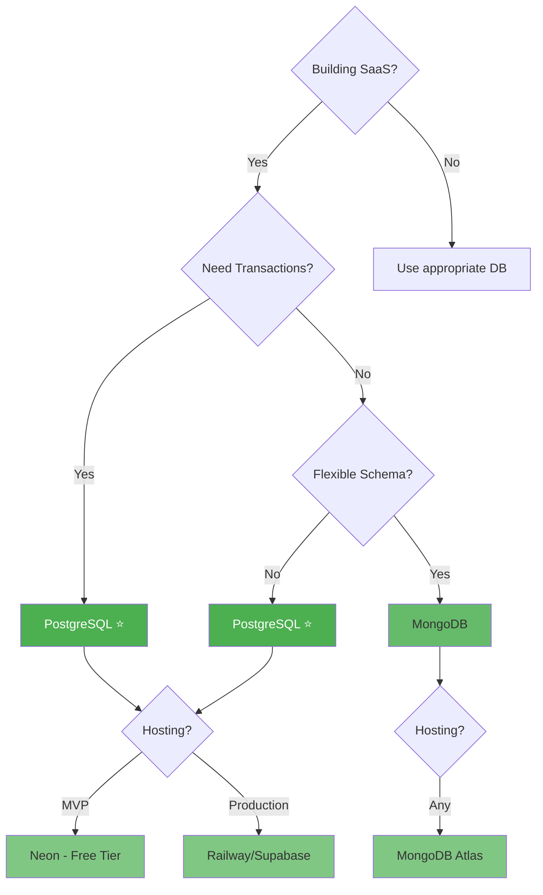
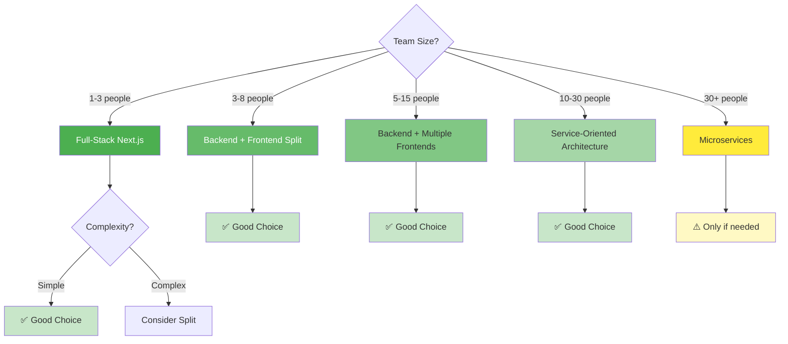
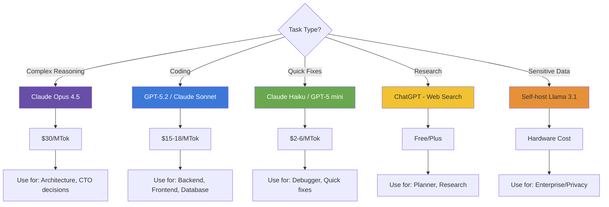
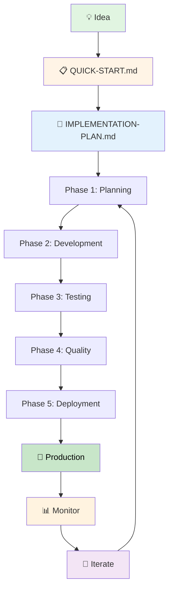

# Ultra-Dex Workflow Diagrams

Visual representations of agent workflows and production pipelines.

---

## 🎯 Standard Production Pipeline

```mermaid
graph TD
    Start([New Feature Request]) --> A[@Planner]
    A -->|Tasks Defined| B[@CTO]
    B -->|Architecture Approved| C{Needs Database?}

    C -->|Yes| D[@Database]
    C -->|No| E[@Backend]
    D -->|Schema Ready| E

    E -->|API Complete| F[@Frontend]
    F -->|UI Complete| G{Auth/Payments?}

    G -->|Yes| H[@Auth / @Security]
    G -->|No| I[@Testing]
    H -->|Audit Complete| I

    I -->|Tests Passing| J[@Reviewer]
    J -->|Code Approved| K[@DevOps]
    K --> End([Deployed to Production])

    style Start fill:#e1f5e1
    style End fill:#e1f5e1
    style A fill:#fff4e6
    style B fill:#fff4e6
    style D fill:#e3f2fd
    style E fill:#e3f2fd
    style F fill:#e3f2fd
    style H fill:#fce4ec
    style I fill:#f3e5f5
    style J fill:#f3e5f5
    style K fill:#e0f2f1
```

**Legend:**
- 🟡 Yellow: Leadership Tier
- 🔵 Blue: Development Tier
- 🔴 Pink: Security Tier
- 🟣 Purple: Quality Tier
- 🟢 Green: DevOps Tier

---

## 🚀 Authentication Feature Workflow

```mermaid
graph LR
    A[@Planner] -->|4 tasks| B[@CTO]
    B -->|JWT + httpOnly cookies| C[@Database]
    C -->|User table| D[@Backend]
    D -->|/signup, /login, /logout| E[@Frontend]
    E -->|Login/Signup pages| F[@Security]
    F -->|Audit passed| G[@Reviewer]
    G -->|Approved| H[@DevOps]

    style A fill:#fff4e6
    style B fill:#fff4e6
    style C fill:#e3f2fd
    style D fill:#e3f2fd
    style E fill:#e3f2fd
    style F fill:#fce4ec
    style G fill:#f3e5f5
    style H fill:#e0f2f1
```

**Time:** ~30 minutes with AI agents
**Agents used:** 7

---

## 💳 Payment Integration Workflow (Stripe)

```mermaid
graph TD
    A[@Research] -->|Stripe Checkout| B[@CTO]
    B -->|Webhook architecture| C[@Database]
    C -->|Subscription table| D[@Backend]
    D -->|Checkout + webhooks| E[@Frontend]
    E -->|Checkout button| F[@Testing]
    F -->|Test cards| G[@Security]
    G -->|Webhook signature| H[@DevOps]

    style A fill:#fff4e6
    style B fill:#fff4e6
    style C fill:#e3f2fd
    style D fill:#e3f2fd
    style E fill:#e3f2fd
    style F fill:#f3e5f5
    style G fill:#fce4ec
    style H fill:#e0f2f1
```

**Time:** ~45 minutes with AI agents
**Agents used:** 7

---

## 🐛 Bug Fix Workflow (Fast Track)

```mermaid
graph LR
    A[@Debugger] -->|Root cause found| B[@Backend/Frontend]
    B -->|Fix implemented| C[@Testing]
    C -->|Regression test| D[@Reviewer]
    D -->|Quick review| E[@DevOps]
    E -->|Hotfix deployed| End([Fixed])

    style A fill:#f3e5f5
    style B fill:#e3f2fd
    style C fill:#f3e5f5
    style D fill:#f3e5f5
    style E fill:#e0f2f1
    style End fill:#e1f5e1
```

**Time:** ~15-30 minutes
**Agents used:** 4-5

---

## ⚡ Performance Optimization Workflow

```mermaid
graph TD
    Start([Slow Page/API]) --> A[@Performance]
    A -->|Bottleneck identified| B{Issue Type?}

    B -->|Database| C[@Database]
    B -->|Backend| D[@Backend]
    B -->|Frontend| E[@Frontend]

    C -->|Query optimized| F[@Testing]
    D -->|Code optimized| F
    E -->|Bundle reduced| F

    F -->|Performance verified| G[@Reviewer]
    G -->|Approved| End([Deployed])

    style Start fill:#ffebee
    style A fill:#fff3e0
    style C fill:#e3f2fd
    style D fill:#e3f2fd
    style E fill:#e3f2fd
    style F fill:#f3e5f5
    style G fill:#f3e5f5
    style End fill:#e1f5e1
```

**Time:** ~30-60 minutes depending on complexity
**Agents used:** 4-6

---

## 🔄 Multi-Tool AI Coordination

```mermaid
graph TD
    Plan[User Request] --> A{Choose AI Tool}

    A -->|Free| ChatGPT[@Planner in ChatGPT]
    A -->|Best Reasoning| Claude[@CTO in Claude Opus]
    A -->|Fast Coding| Cursor[@Backend in Cursor]

    ChatGPT -->|Tasks to PLAN.md| B[IMPLEMENTATION-PLAN.md]
    Claude -->|Architecture to PLAN.md| B
    Cursor -->|Code to repo| B

    B --> C{Next Agent?}
    C -->|Yes| A
    C -->|No| Deploy[@DevOps in Claude Sonnet]

    Deploy --> End([Production])

    style Plan fill:#e1f5e1
    style ChatGPT fill:#fff4e6
    style Claude fill:#fff4e6
    style Cursor fill:#e3f2fd
    style B fill:#fff9c4
    style Deploy fill:#e0f2f1
    style End fill:#e1f5e1
```

**Key:** All tools read/write to shared IMPLEMENTATION-PLAN.md
**Cost Savings:** 3-5x cheaper than single tool

---

## 📊 Agent Tier Structure

```mermaid
graph TD
    subgraph Leadership[1. Leadership Tier]
        CTO[@CTO]
        Planner[@Planner]
        Research[@Research]
    end

    subgraph Development[2. Development Tier]
        Backend[@Backend]
        Frontend[@Frontend]
        Database[@Database]
    end

    subgraph Security[3. Security Tier]
        Auth[@Auth]
        SecurityAgent[@Security]
    end

    subgraph DevOps[4. DevOps Tier]
        DevOpsAgent[@DevOps]
    end

    subgraph Quality[5. Quality Tier]
        Testing[@Testing]
        Documentation[@Documentation]
        Reviewer[@Reviewer]
        Debugger[@Debugger]
    end

    subgraph Specialist[6. Specialist Tier]
        Performance[@Performance]
        Refactoring[@Refactoring]
    end

    Leadership --> Development
    Development --> Security
    Security --> Quality
    Quality --> DevOps
    Specialist -.Optional.-> Quality

    style Leadership fill:#fff4e6
    style Development fill:#e3f2fd
    style Security fill:#fce4ec
    style DevOps fill:#e0f2f1
    style Quality fill:#f3e5f5
    style Specialist fill:#fff3e0
```

**Flow:** Leadership → Development → Security → Quality → DevOps

---

## 🎯 Decision Tree: Database Selection



**Recommendation:** PostgreSQL for 90% of SaaS projects

---

## 🏗️ Decision Tree: Architecture Pattern



**Default:** Start with Next.js, scale when needed

---

## 🤖 Decision Tree: AI Model Selection



**Hybrid Strategy:** Use best model for each task = 3-5x cost savings

---

## 📈 Development Lifecycle



**Duration:**
- MVP: 2-4 weeks with AI agents
- Full SaaS: 8-12 weeks with AI agents

---

## 🔗 Workflow Resources

**Detailed Workflows:**
- [Project Orchestration Guide](./guides/PROJECT-ORCHESTRATION.md) - Complete auth workflow
- [Advanced Workflows](./guides/ADVANCED-WORKFLOWS.md) - Stripe, emails, migrations
- [Multi-Tool Workflow](./guides/MULTI-TOOL-WORKFLOW.md) - Coordinate multiple AIs

**Agent Reference:**
- [Agent Index](./agents/00-AGENT_INDEX.md) - All 17 agents with "when to use"
- [Agents README](./agents/README.md) - Tier-based organization

**Decision Guides:**
- [Database Selection](./guides/DATABASE-DECISION-FRAMEWORK.md) - PostgreSQL vs MongoDB
- [Architecture Patterns](./guides/ARCHITECTURE-PATTERNS.md) - Team size to architecture
- [AI Model Selection](./guides/AI-MODEL-SELECTION.md) - Cost optimization

---

## 💡 Using These Diagrams

**In Documentation:**
- Embed Mermaid diagrams in markdown files
- GitHub/GitLab render Mermaid natively

**In Presentations:**
- Export diagrams as SVG/PNG
- Use in pitch decks, team meetings

**In Planning:**
- Map your feature to standard workflow
- Identify which agents you need
- Estimate time and cost

---

## 🎓 Diagram Legend

| Color | Tier | Agents |
|-------|------|--------|
| 🟡 Yellow | Leadership | CTO, Planner, Research |
| 🔵 Blue | Development | Backend, Frontend, Database |
| 🔴 Pink | Security | Auth, Security |
| 🟢 Teal | DevOps | DevOps |
| 🟣 Purple | Quality | Testing, Documentation, Reviewer, Debugger |
| 🟠 Orange | Specialist | Performance, Refactoring |

**Decision Nodes:** Diamond shape
**Processes:** Rectangle shape
**Start/End:** Rounded rectangle

---

## 📝 Creating Custom Diagrams

**Mermaid Syntax:**
```markdown
\`\`\`mermaid
graph TD
    A[@YourAgent] --> B[@NextAgent]
    B --> C{Decision?}
    C -->|Yes| D[@Agent3]
    C -->|No| E[@Agent4]
\`\`\`
```

**Tools:**
- [Mermaid Live Editor](https://mermaid.live/) - Online editor
- VSCode Mermaid extension - Edit in IDE
- GitHub Markdown - Renders automatically

**Learn More:**
- [Mermaid Documentation](https://mermaid.js.org/)
- [Mermaid GitHub](https://github.com/mermaid-js/mermaid)

---

*Ultra-Dex v3.4.3 - Visual workflows for AI-driven development*

**These diagrams are living documentation - update them as your workflow evolves!**
