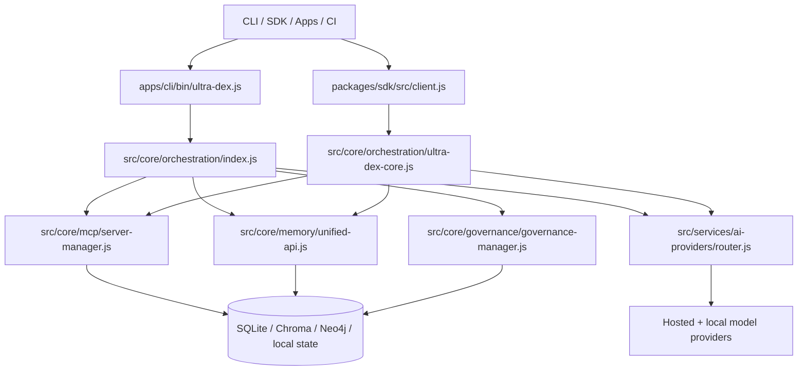

# Ultra-Dex Architecture

Canonical architecture reference for the `@ultra-dex/monorepo` publish surface. The repository package version is `2.0.0`; some internal module banners still carry older `6.x` revision labels, but the file paths and runtime boundaries below reflect the current codebase.

## System Overview

## Core Execution Flow

1. CLI entrypoints in `apps/cli/bin/` parse commands and load the command module for the requested workflow.
2. Command modules build task context, gather project state, and choose a provider or orchestration path.
3. `src/core/orchestration/index.js` creates or reuses an `AgentOrchestrator` session.
4. Governance gates run before execution through `src/core/governance/governance-manager.js`.
5. The orchestrator queries memory, resolves the target agent prompt, and dispatches through the AI layer or provider router.
6. Results, traces, and audit entries are written back to runtime state, memory stores, and CLI artifacts.

## Module Reference

| Path | Responsibility | Key exports | Depends on |
| --- | --- | --- | --- |
| `src/core/index.js` | Top-level meta-layer facade and compatibility shims | `ultraDex`, `UltraDexMetaLayer` | orchestrator, memory, AI layer, health |
| `src/core/orchestration/index.js` | Multi-agent execution runtime | `AgentOrchestrator`, `agentOrchestrator` | governance, memory, MCP, AI layer |
| `src/core/orchestration/ultra-dex-core.js` | Programmatic core bootstrap used by the SDK | `UltraDexCore` | config, observability, memory, agent registry, MCP, provider router |
| `src/core/ai/ai-meta-layer.js` | Provider abstraction, routing hints, cache, fallback | `AIMetaLayer`, `aiMetaLayer` | provider SDK packages, performance metrics |
| `src/services/ai-providers/router.js` | Request routing, provider health, fallback chains | `AIProviderRouter` | registered provider instances |
| `src/core/memory/unified-api.js` | Unified memory interface for relational, vector, and graph storage | `UnifiedMemory` | sqlite, chroma, neo4j drivers |
| `src/core/agents/ralph-loop.js` | Autonomous reasoning loop used by Nexus execution | `RALPHLoop` | event emitter, orchestrator callbacks |
| `src/core/governance/governance-manager.js` | Policy gating and audit persistence | `GovernanceManager`, `GovernanceDeniedException` | governance engine, audit DB |
| `src/core/mcp/server-manager.js` | MCP server lifecycle plus in-process MCP tools | `MCPServerManager` | child processes, local MCP tool registry |
| `packages/sdk/src/client.js` | Standalone npm-facing SDK entrypoint | `UltraDex`, `Agent`, `BaseProvider`, `PluginLoader` | local SDK runtime shims |

## Data Flow

1. Input arrives from CLI args, SDK calls, or app UI actions.
2. The runtime resolves configuration from env, config files, and user options.
3. Project context is read from local state, plan files, and optionally graph or memory systems.
4. Governance records an audit entry and can reject execution before any provider call.
5. Memory retrieval augments the prompt or task with prior context.
6. Provider routing selects the best available model or fallback chain.
7. The agent or orchestrator executes and emits traces, summaries, and artifacts.
8. Memory, audit, and observability systems persist the outcome for later recall.

## Agent System

- `AgentOrchestrator` owns task sessions, metrics, governance checks, and MCP tool access.
- The orchestrator keeps an `AgentRegistry`, `AgentCommunicationBus`, `TaskGraph`, and `TaskRouter`.
- Nexus execution delegates to `runAutonomousTask` in `src/core/agents/ralph-loop.js` when autonomous reasoning is required.
- Task routing is semantic-first through `src/core/orchestration/task-router.js`, with fallback keyword routing if similarity is weak.
- Distributed coordination is implemented in `src/core/orchestration/distributed-coordinator.js` for multi-instance scenarios.

## Memory Architecture

- `UnifiedMemory` is the canonical interface.
- SQLite is used for relational context and durable local records.
- Chroma is the vector tier for semantic recall.
- Neo4j is the graph tier for entity and relationship traversal.
- A local in-memory cache fronts high-priority lookups and recent writes.
- Storage APIs expose `store`, `retrieve`, cache-aware lookup, and tier-specific backends.

## Provider Routing

- `AIMetaLayer` exposes a model-agnostic `call` interface and chooses providers based on task metadata.
- `AIProviderRouter` tracks provider registration, health, model catalogs, token costs, and fallback statistics.
- Routing strategies support cost, quality, latency, direct provider selection, and fallback retry.
- Mock mode is a first-class runtime path used by tests and local deterministic execution.

## Governance

- Governance gates execute before task execution or protected tool use.
- Custom policies can be added through `GovernanceManager.policies.addPolicy(...)`.
- Audit persistence flows through `src/core/governance/audit-db.js` and the manager audit facade.
- Denials surface as `GovernanceDeniedException` and are recorded with agent, action, task, and outcome metadata.

## MCP Integration

- `MCPServerManager` owns external MCP server registration, startup, restart, health, and tool dispatch.
- The manager now also registers in-process tools under the local `ultra-dex-core` server id.
- Built-in tool coverage currently includes agent status, task submission, memory search, and provider info.
- The CLI-side MCP server in `apps/cli/lib/mcp/server.js` exposes the richer interactive tool registry for the CLI runtime.

## Extension Points

### Add a provider

1. Implement a provider adapter or register an instance in `src/services/ai-providers/router.js`.
2. Define model metadata, cost metadata, and health behavior.
3. Wire it into `UltraDexCore._loadDefaultProviders()` or the SDK runtime if it belongs to the publish surface.

### Add an agent

1. Register the agent in the relevant registry or CLI agent catalog.
2. Provide a prompt contract and capability description.
3. Ensure governance and tool permissions are explicit for the new role.

### Add an MCP tool

1. Create a tool module in `src/core/mcp/tools/`.
2. Return a tool definition with `name`, `description`, `inputSchema`, and `handler`.
3. Register it in `src/core/mcp/server-manager.js`.
4. Add direct unit coverage in `tests/core/`.

### Add SDK surface

1. Keep all imports inside `packages/sdk/`.
2. Update `packages/sdk/package.json` exports and `packages/sdk/types/`.
3. Verify `npm pack --dry-run` includes the new public files.
