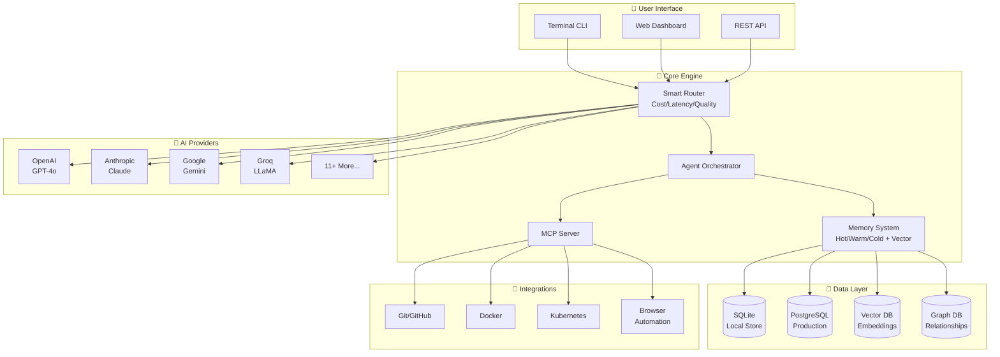
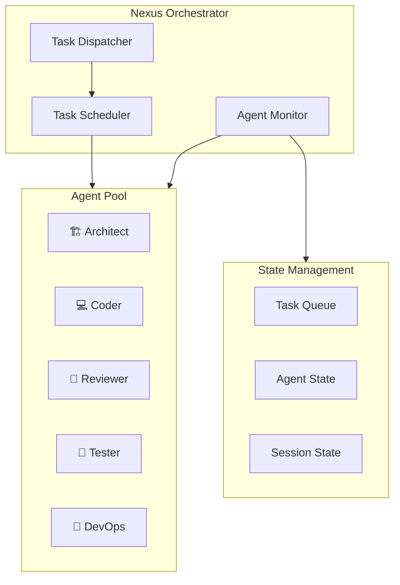
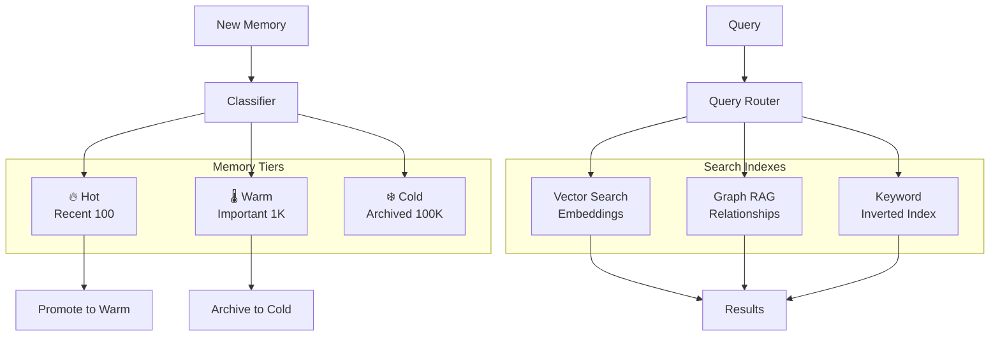
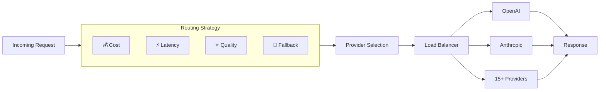

# 🌌 Ultra-Dex Architecture: The v6.0.0 Meta-Layer

> **Version:** 6.0.0  
> **Last Updated:** 2026-02-12

Ultra-Dex is an **AI Orchestration Meta-Layer** designed for high-autonomy, high-reliability software engineering. It moves beyond simple prompt-following to a **Cognitive Operating System** for agent swarms.

## 🏗️ Structural Foundation

The system is organized as a high-performance monorepo:

- `src/core/`: The Brain. Contains the Nexus orchestrator, tiered relational memory, and autonomous loops.
- `apps/cli/`: The Interface. High-speed terminal entry point for human-agent coordination.
- `apps/dashboard/`: The Observability Layer. Real-time visual monitoring of agent cognitive states.
- `src/services/security/`: The Steel Gate. Docker-hardened sandboxes and static code validation.

## System Overview



## 🧠 Cognitive Pillars

### 1. Nexus Orchestrator (`src/core/orchestration`)

The Nexus is the central reasoning hub. It decomposes high-level objectives into atomic, tier-specific tasks and manages the parallel execution of the agent swarm.



### 2. Ralph Loop: Autonomous Execution (`src/core/agents`)

The **Reasoning & Action Loop for Persistent Hub (Ralph)** allows agents to autonomously:

- PLAN: Multi-path architectural simulation.
- ACT: Code generation and execution in hardened Docker sandboxes.
- VERIFY: Automated technical checks via Protocol 21.
- RECOVER: Self-healing loops for failed tests or linting errors.

### 3. Relational Knowledge Graph (`src/core/memory`)

Ultra-Dex uses a three-tier memory system:



- Hot Tier (Memory): Active session context.
- Warm Tier (SQLite): Persistent observations and codebase mapping.
- Cold Tier (Knowledge Graph): Relational links between architectural decisions (WHY) and implemented code (WHAT).

### 4. Smart AI Router (`src/core/ai`)



## 🛡️ The Steel Gate: Protocol 21

Every agent output must pass through Protocol 21—a mandatory 21-step verification engine that automates:

- Technical Validation (Lint, Types, Build)
- Security Scans (Static analysis, risky patterns)
- Performance Audits (Complexity checks)

## 🌐 Bidirectional MCP Ecosystem

Ultra-Dex acts as a central **Model Context Protocol (MCP)** Hub:

- As a Host: Consumes context from external tools (GitHub, Docker, Google Search).
- As a Server: Exposes internal agent states and memory to IDEs (Cursor, VS Code) and other AI agents.

## Data Flow

```
User Request
    ↓
CLI/API Parse
    ↓
Smart Router
    ├── Check Cache
    ├── Select Provider (15+ options)
    └── Apply Strategy (cost/latency/quality)
    ↓
Provider API Call
    ↓
Response Processing
    ├── Token Counting
    ├── Cost Tracking
    └── Latency Metrics
    ↓
Memory Store (Hot → Warm → Cold)
    ↓
Result Return
```

## Extension Points

### Provider Extension

Ultra-Dex supports 15+ AI providers with a unified interface. Adding a new provider is simple:

```javascript
class MyProvider extends OpenAICompatibleProvider {
  constructor(config) {
    super('myprovider', {
      baseUrl: config.baseUrl,
      apiKey: config.apiKey,
      defaultModel: config.defaultModel,
    });
  }
}

providerRegistry.registerProvider('myprovider', new MyProvider(config));
```

### Agent Extension

```javascript
class CustomAgent extends Agent {
  constructor() {
    super({
      id: 'custom',
      name: 'Custom Agent',
      capabilities: ['custom-task'],
    });
  }

  async execute(task) {
    // Custom implementation
  }
}

agentManager.register('custom', CustomAgent);
```

## Performance Characteristics

| Component     | Latency | Throughput     | Scalability |
| ------------- | ------- | -------------- | ----------- |
| CLI           | <100ms  | N/A            | N/A         |
| Router        | <10ms   | 1000 RPS       | Horizontal  |
| Agent Exec    | 1-30s   | 100 concurrent | Vertical    |
| Memory Query  | <50ms   | 500 QPS        | Horizontal  |
| Vector Search | <200ms  | 100 QPS        | Horizontal  |

## Deployment Patterns

### Local Development

```
┌─────────────────────────────────────┐
│  Local Machine                       │
│  ┌─────────┐  ┌──────────────────┐  │
│  │ CLI     │  │ SQLite + Vector  │  │
│  │         │  │ Local Memory     │  │
│  └────┬────┘  └──────────────────┘  │
│       │                              │
│  ┌────▼────┐  ┌──────────────────┐  │
│  │ Core    │  │ AI Providers     │  │
│  │ Runtime │  │ (Remote APIs)    │  │
│  └─────────┘  └──────────────────┘  │
└─────────────────────────────────────┘
```

### Production Cluster

```
┌──────────────────────────────────────────┐
│  Kubernetes Cluster                       │
│  ┌──────────────┐    ┌──────────────┐   │
│  │ CLI Pods     │    │ API Pods     │   │
│  │ (Horizontal) │    │ (Load Bal)   │   │
│  └──────┬───────┘    └──────┬───────┘   │
│         │                    │           │
│  ┌──────▼────────────────────▼───────┐   │
│  │       Core Service Mesh           │   │
│  │  ┌────────┐ ┌────────┐ ┌──────┐  │   │
│  │  │Router  │ │Memory  │ │MCP   │  │   │
│  │  │Service │ │Service │ │Server│  │   │
│  │  └────────┘ └────────┘ └──────┘  │   │
│  └──────────────────────────────────┘   │
│         │                               │
│  ┌──────▼────────────────────▼───────┐   │
│  │       Data Layer                   │   │
│  │  PostgreSQL  VectorDB  GraphDB     │   │
│  └──────────────────────────────────┘   │
└──────────────────────────────────────────┘
```

## Version Compatibility

| Component | Min Version | Current | Notes             |
| --------- | ----------- | ------- | ----------------- |
| Node.js   | 18.0.0      | 20.x    | LTS required      |
| Protocol  | 2.0.0       | 2.0.0   | Agent Protocol    |
| Providers | 1.0.0       | 6.0.0   | Unified interface |
| SDK       | 6.0.0       | 6.0.0   | JavaScript/TS     |

---

_Ultra-Dex v6.0.0 - Built for the GenAI 2.0 Era._
