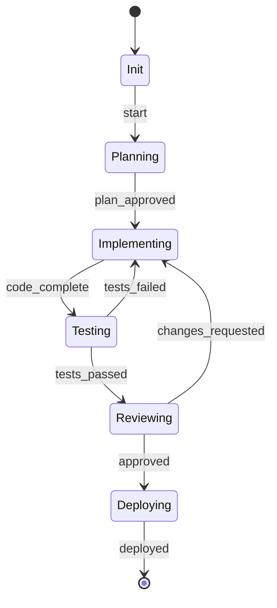

# Ultra-Dex Phase 5 - All Prompts for Agents

> **Total:** 15 New Features | Copy to Codex/Claude/Gemini
> **Date:** Feb 5, 2026

---

## 🔴 CRITICAL PRIORITY (Week 1)

---

### PROMPT 1: Claude Sonnet 5 "Fennec" Integration (1 day)

```
## Task: Add Claude Sonnet 5 Model Support

**Files to modify:**
- cli/lib/providers/claude.js
- cli/lib/providers/index.js
- cli/lib/utils/config-manager.js

**Requirements:**

1. Update claude.js to support new model:
   - Add model constant: `CLAUDE_SONNET_5 = 'claude-sonnet-5-20260201'`
   - Add model alias: `fennec` → `claude-sonnet-5-20260201`
   - Support model selection via `--model sonnet5` or `--model fennec`

2. Update config-manager.js:
   - Add `ULTRA_DEX_CLAUDE_MODEL` env variable
   - Default to `claude-sonnet-5-20260201` if available
   - Fallback to `claude-3-5-sonnet-20241022` if not

3. Add auto-detection:
   - Check API access to Sonnet 5
   - Graceful fallback with warning message
   - Log model version being used

4. Update model pricing in token-forecast.js:
   - Sonnet 5: $3/$15 per 1M tokens (input/output)

**Usage:**
npx ultra-dex generate "Build auth" --model fennec
npx ultra-dex config set model claude-sonnet-5

**Tests:**
- Add test in tests/providers/claude.test.js
- Mock Sonnet 5 responses

**Commit:** "feat: Add Claude Sonnet 5 Fennec model support"
```

---

### PROMPT 2: MCP Apps - Interactive UI in Chat (3 days)

```
## Task: Implement MCP Apps Support

**Files to create:**
- cli/lib/mcp/apps/index.js (NEW)
- cli/lib/mcp/apps/components.js (NEW)
- cli/lib/mcp/apps/renderer.js (NEW)
- cli/lib/mcp/apps/schemas/ (NEW directory)

**Requirements:**

1. Create MCP App protocol handler:
   - Support JSON-RPC 2.0 app rendering messages
   - Implement `mcp/app/render` method
   - Implement `mcp/app/update` method
   - Implement `mcp/app/interact` method

2. Create component library (components.js):
   - Dashboard component (show project status)
   - Progress component (show task progress)
   - Form component (input wizards)
   - Table component (data display)
   - Chart component (metrics visualization)
   - Button component (action triggers)

3. Create renderer (renderer.js):
   - Render components to terminal (ink/blessed)
   - Render components to VS Code WebView
   - Render components to web dashboard

4. Create app schemas:
   - schemas/dashboard.json - Project dashboard
   - schemas/task-progress.json - Task tracker
   - schemas/agent-status.json - Agent monitoring

5. Integrate with MCP server (cli/lib/mcp/server.js):
   - Register app handlers
   - Handle bidirectional communication
   - Maintain app state

6. Add VS Code extension support:
   - Update vscode/src/panels/ for app rendering
   - Handle app events from extension

**Usage:**
The MCP server will automatically render apps when AI requests:
{
  "method": "mcp/app/render",
  "params": {
    "component": "dashboard",
    "data": { "project": "myapp", "score": 85 }
  }
}

**Demo:**
npx ultra-dex serve
# AI can now render interactive dashboards in chat

**Commit:** "feat: Add MCP Apps with interactive UI components"
```

---

### PROMPT 3: Persistent Agent Sessions - Multi-Day Agents (4 days)

````
## Task: Implement Persistent Agent Sessions

**Files to create:**
- cli/lib/agents/session-manager.js (NEW)
- cli/lib/agents/checkpoint.js (NEW)
- cli/lib/agents/daemon.js (NEW)
- cli/lib/agents/queue.js (NEW)
- cli/lib/commands/session.js (NEW)

**Requirements:**

1. Create session-manager.js:
   - Initialize agent session with UUID
   - Track session state (running, paused, completed, failed)
   - Persist session to SQLite (.ultra-dex/sessions.db)
   - Resume session from checkpoint
   - List all sessions with status

2. Create checkpoint.js:
   - Save checkpoint every N steps (configurable, default 10)
   - Store: agent state, context, history, current task
   - Compress old checkpoints (keep last 5 full, rest diffs)
   - Restore from any checkpoint

3. Create daemon.js:
   - Background agent process
   - Runs even after terminal closes
   - Heartbeat monitoring (every 30s)
   - Notification on completion/error
   - Auto-restart on crash

4. Create queue.js:
   - Task queue for agents
   - Priority levels (p0, p1, p2, p3)
   - Dependencies between tasks
   - Parallel execution support

5. Create session command:
   - `ultra-dex session list` - Show all sessions
   - `ultra-dex session start <task>` - Start new session
   - `ultra-dex session resume <id>` - Resume session
   - `ultra-dex session pause <id>` - Pause session
   - `ultra-dex session stop <id>` - Stop session
   - `ultra-dex session logs <id>` - View logs
   - `ultra-dex session status` - Show running sessions

6. Add notifications:
   - Desktop notification on task complete
   - Slack/Discord webhook support
   - Email notification option

**Database Schema (sessions.db):**
```sql
CREATE TABLE sessions (
  id TEXT PRIMARY KEY,
  name TEXT,
  status TEXT, -- running, paused, completed, failed
  agent TEXT,
  task TEXT,
  started_at DATETIME,
  updated_at DATETIME,
  completed_at DATETIME,
  checkpoint_count INTEGER,
  error TEXT
);

CREATE TABLE checkpoints (
  id TEXT PRIMARY KEY,
  session_id TEXT,
  step INTEGER,
  state BLOB,
  created_at DATETIME,
  FOREIGN KEY (session_id) REFERENCES sessions(id)
);
````

**Usage:**
npx ultra-dex session start "Build complete auth system with OAuth"

# Returns: Session abc123 started. Running in background.

npx ultra-dex session status

# Shows: abc123 | running | 45% | Step 23/50

npx ultra-dex session resume abc123

**Commit:** "feat: Add persistent agent sessions with checkpoint/resume"

```

---

### PROMPT 4: LangGraph State Visualization (2 days)

```

## Task: Add LangGraph State Graph Visualization

**Files to create:**

- cli/lib/graph/visualizer.js (NEW)
- cli/lib/graph/state-machine.js (NEW)
- dashboard/src/components/StateGraph.tsx (NEW)

**Requirements:**

1. Create state-machine.js:
   - Define agent workflow as state graph
   - States: init, planning, implementing, testing, reviewing, deploying, complete
   - Transitions with conditions
   - Track current state and history

2. Create visualizer.js:
   - Generate Mermaid diagram from state graph
   - Export to SVG/PNG
   - Terminal ASCII visualization (with boxen)
   - JSON export for dashboard

3. Create StateGraph React component:
   - Interactive graph visualization
   - Clickable nodes (show details)
   - Real-time state updates via WebSocket
   - Animation on state transitions
   - Color coding: green=complete, yellow=current, gray=pending

4. Add to swarm orchestrator:
   - Track state transitions
   - Emit WebSocket events on state change
   - Store state history in SQLite

5. Add CLI command:
   - `ultra-dex graph` - Show current state graph
   - `ultra-dex graph --export mermaid` - Export as Mermaid
   - `ultra-dex graph --export svg` - Export as SVG
   - `ultra-dex graph --live` - Real-time terminal view

**State Graph Example:**



**Commit:** "feat: Add LangGraph state visualization with dashboard"

```

---

### PROMPT 5: Remote MCP Server (3 days)

```

## Task: Implement Remote MCP Server Support

**Files to create:**

- cli/lib/mcp/remote/server.js (NEW)
- cli/lib/mcp/remote/client.js (NEW)
- cli/lib/mcp/remote/auth.js (NEW)
- cli/lib/mcp/remote/sync.js (NEW)
- cli/lib/commands/mcp-remote.js (NEW)

**Requirements:**

1. Create remote server (server.js):
   - Express.js server with WebSocket upgrade
   - Can be self-hosted or use Ultra-Dex cloud
   - Handle multiple client connections
   - Rate limiting per API key
   - HTTPS/WSS only

2. Create remote client (client.js):
   - Connect to remote MCP server
   - Authenticate with API key
   - Subscribe to context updates
   - Push local changes to server

3. Create auth system (auth.js):
   - API key generation and validation
   - JWT tokens for session
   - Team/org access control
   - Key rotation support

4. Create sync engine (sync.js):
   - Bidirectional CONTEXT.md sync
   - Conflict resolution (last-write-wins or merge)
   - Offline support with queue
   - Incremental sync (only changes)

5. Create CLI commands:
   - `ultra-dex mcp:remote start` - Start remote server locally
   - `ultra-dex mcp:remote connect <url>` - Connect to remote
   - `ultra-dex mcp:remote disconnect` - Disconnect
   - `ultra-dex mcp:remote status` - Show connection status
   - `ultra-dex mcp:remote sync` - Force sync

6. Add to config:
   - ULTRA_DEX_REMOTE_URL
   - ULTRA_DEX_REMOTE_KEY
   - ULTRA_DEX_REMOTE_AUTO_SYNC (true/false)

**Usage:**

# Start your own remote server

npx ultra-dex mcp:remote start --port 4000

# Connect team members

npx ultra-dex mcp:remote connect wss://mcp.ultra-dex.io

# Enter API key: \*\*\*\*

# Now context syncs across all team members

**Commit:** "feat: Add remote MCP server with team sync"

```

---

## 🟡 HIGH PRIORITY (Week 2)

---

### PROMPT 6: Agent Marketplace (1 week)

```

## Task: Create Agent Marketplace

**Files to create:**

- cli/lib/marketplace/registry.js (enhance)
- cli/lib/marketplace/publish.js (NEW)
- cli/lib/marketplace/search.js (NEW)
- cli/lib/marketplace/install.js (enhance)
- cli/lib/commands/marketplace.js (NEW)

**Requirements:**

1. Create publish workflow:
   - Package agent as .tar.gz
   - Validate agent structure (manifest.json required)
   - Upload to registry (npm-style)
   - Versioning with semver

2. Create search functionality:
   - Search by name, tags, author
   - Filter by category (frontend, backend, security, etc.)
   - Sort by downloads, rating, date
   - Show agent details (description, usage, reviews)

3. Create install system:
   - Install from registry: `ultra-dex agent install @user/agent-name`
   - Install from local: `ultra-dex agent install ./my-agent`
   - Install from git: `ultra-dex agent install github:user/repo`
   - Dependency resolution

4. Create agent manifest (manifest.json):

```json
{
  "name": "@srujan/auth-agent",
  "version": "1.0.0",
  "description": "Specialized authentication agent",
  "author": "Srujan",
  "tier": "backend",
  "capabilities": ["oauth", "jwt", "session"],
  "dependencies": ["@ultra-dex/core"],
  "config": {
    "model": "claude-sonnet-5",
    "temperature": 0.3
  }
}
```

5. CLI commands:
   - `ultra-dex market search <query>` - Search agents
   - `ultra-dex market install <name>` - Install agent
   - `ultra-dex market publish` - Publish agent
   - `ultra-dex market list` - List installed
   - `ultra-dex market uninstall <name>` - Uninstall
   - `ultra-dex market info <name>` - Show details

**Commit:** "feat: Add agent marketplace with publish/install"

```

---

### PROMPT 7: AI Code Review Bot (1 week)

```

## Task: Create GitHub/GitLab Code Review Bot

**Files to create:**

- cli/lib/bots/code-review/index.js (NEW)
- cli/lib/bots/code-review/github.js (NEW)
- cli/lib/bots/code-review/gitlab.js (NEW)
- cli/lib/bots/code-review/analyzer.js (NEW)
- cli/lib/commands/bot.js (NEW)

**Requirements:**

1. Create GitHub integration (github.js):
   - GitHub App or Personal Token auth
   - Listen for PR events (opened, updated)
   - Post review comments inline
   - Request changes or approve
   - Add labels based on analysis

2. Create GitLab integration (gitlab.js):
   - GitLab API integration
   - MR event webhooks
   - Inline comments on diffs
   - Approval workflow

3. Create analyzer (analyzer.js):
   - Diff analysis (detect file changes)
   - Code quality checks:
     - Security vulnerabilities
     - Performance issues
     - Code style violations
     - Missing tests
     - Documentation gaps
   - Suggest improvements with code snippets
   - Severity levels (critical, warning, info)

4. Create review report:
   - Summary comment with overall score
   - Categorized issues
   - Auto-fix suggestions (where possible)
   - Link to documentation

5. CLI commands:
   - `ultra-dex bot setup github` - Setup GitHub bot
   - `ultra-dex bot setup gitlab` - Setup GitLab bot
   - `ultra-dex bot start` - Start webhook server
   - `ultra-dex bot review <pr-url>` - Manual review
   - `ultra-dex bot status` - Show bot status

**Environment Variables:**

- ULTRA_DEX_GITHUB_TOKEN
- ULTRA_DEX_GITHUB_WEBHOOK_SECRET
- ULTRA_DEX_GITLAB_TOKEN

**Example Review Comment:**

````markdown
## 🤖 Ultra-Dex Code Review

### Summary: 8.5/10

### 🔴 Critical (1)

- **Line 45**: SQL injection vulnerability in user query
  ```diff
  - db.query(`SELECT * FROM users WHERE id = ${userId}`)
  + db.query('SELECT * FROM users WHERE id = ?', [userId])
  ```
````

### 🟡 Warnings (2)

- **Line 23**: Missing error handling for async operation
- **Line 67**: Unused import 'lodash'

### 🟢 Suggestions (1)

- Consider adding JSDoc comments to exported functions

```

**Commit:** "feat: Add AI code review bot for GitHub/GitLab"
```

---

### PROMPT 8: Multi-Runtime Docker Sandbox (3 days)

```
## Task: Add Multi-Runtime Sandbox Support

**Files to modify:**
- cli/lib/sandbox/docker.js
- cli/lib/sandbox/permissions.js

**Files to create:**
- cli/lib/sandbox/runtimes/node.js (NEW)
- cli/lib/sandbox/runtimes/python.js (NEW)
- cli/lib/sandbox/runtimes/go.js (NEW)
- cli/lib/sandbox/runtimes/rust.js (NEW)
- cli/lib/sandbox/Dockerfile.node (NEW)
- cli/lib/sandbox/Dockerfile.python (NEW)
- cli/lib/sandbox/Dockerfile.go (NEW)
- cli/lib/sandbox/Dockerfile.rust (NEW)

**Requirements:**

1. Create runtime definitions:
   - Node.js 22 (default)
   - Python 3.12 with pip
   - Go 1.22
   - Rust 1.76
   - Custom (user-provided Dockerfile)

2. Create Dockerfiles for each runtime:
   - Minimal base images (alpine where possible)
   - Pre-installed common tools
   - Non-root user for security
   - Working directory setup

3. Update docker.js:
   - Detect runtime from file extension
   - Select appropriate container
   - Mount code with correct permissions
   - Handle runtime-specific commands

4. Add runtime-specific features:
   - Node: npm/yarn/pnpm support
   - Python: venv, pip install
   - Go: go mod support
   - Rust: cargo support

5. CLI options:
   - `--runtime node|python|go|rust|custom`
   - `--dockerfile ./path/to/Dockerfile`
   - `--image custom-image:tag`

**Usage:**
npx ultra-dex exec "python main.py" --sandbox --runtime python
npx ultra-dex exec "go run main.go" --sandbox --runtime go
npx ultra-dex exec "cargo test" --sandbox --runtime rust

**Commit:** "feat: Add multi-runtime Docker sandbox support"
```

---

### PROMPT 9: Agent Commerce & Billing (1 week)

````
## Task: Implement Agent Commerce System

**Files to create:**
- cli/lib/commerce/budget.js (NEW)
- cli/lib/commerce/billing.js (NEW)
- cli/lib/commerce/usage.js (NEW)
- cli/lib/commerce/alerts.js (NEW)
- cli/lib/commands/budget.js (NEW)

**Requirements:**

1. Create budget management (budget.js):
   - Set budget limits per agent
   - Set budget limits per project
   - Set budget limits per time period (daily/weekly/monthly)
   - Track spending against limits
   - Alert when approaching limit (80%, 90%, 100%)
   - Hard stop when limit reached

2. Create billing integration (billing.js):
   - Track API costs per provider
   - Aggregate costs per agent/project
   - Export billing reports (CSV, JSON)
   - Stripe integration for paid features

3. Create usage tracking (usage.js):
   - Token usage per request
   - API calls per agent
   - Time spent per task
   - Cost per feature generated

4. Create alerts (alerts.js):
   - Budget threshold alerts
   - Unusual spending detection
   - Daily/weekly cost summaries
   - Slack/Discord/email notifications

5. CLI commands:
   - `ultra-dex budget set --daily 10` - Set $10/day limit
   - `ultra-dex budget status` - Show current spend
   - `ultra-dex budget report --month feb` - Monthly report
   - `ultra-dex budget alert --threshold 80` - Set alert

**Config:**
```json
{
  "budget": {
    "daily": 10,
    "monthly": 200,
    "perAgent": 5,
    "alerts": {
      "slack": "https://hooks.slack.com/...",
      "thresholds": [80, 90, 100]
    }
  }
}
````

**Commit:** "feat: Add agent commerce with budget management"

```

---

### PROMPT 10: Enterprise SSO Integration (1 week)

```

## Task: Implement Enterprise SSO

**Files to create:**

- cli/lib/auth/sso/index.js (NEW)
- cli/lib/auth/sso/saml.js (NEW)
- cli/lib/auth/sso/oidc.js (NEW)
- cli/lib/auth/sso/providers/ (NEW directory)
- cli/lib/commands/auth-sso.js (NEW)

**Requirements:**

1. Create SSO framework (index.js):
   - Support multiple identity providers
   - Token management and refresh
   - Session persistence
   - Logout/revoke

2. Create SAML support (saml.js):
   - SAML 2.0 assertion parsing
   - SP-initiated SSO flow
   - IdP-initiated SSO flow
   - Signature validation

3. Create OIDC support (oidc.js):
   - OpenID Connect 1.0
   - Authorization code flow
   - Token exchange
   - PKCE support

4. Create provider configs:
   - providers/okta.js
   - providers/azure-ad.js
   - providers/google.js
   - providers/auth0.js
   - providers/onelogin.js

5. CLI commands:
   - `ultra-dex auth sso setup` - Interactive setup
   - `ultra-dex auth sso login` - Login via SSO
   - `ultra-dex auth sso logout` - Logout
   - `ultra-dex auth sso status` - Check session

**Config (ultra-dex.config.json):**

```json
{
  "sso": {
    "provider": "okta",
    "domain": "mycompany.okta.com",
    "clientId": "xxx",
    "redirectUri": "http://localhost:9999/callback"
  }
}
```

**Commit:** "feat: Add enterprise SSO with SAML/OIDC"

```

---

## 🟢 MEDIUM PRIORITY (Month 2)

---

### PROMPT 11: Cloud IDE (Browser-based) (3 weeks)

```

## Task: Create Browser-based Cloud IDE

**Files to create:**

- cloud/ide/ (NEW directory - Vite + React project)
- cloud/ide/src/components/Editor.tsx
- cloud/ide/src/components/Terminal.tsx
- cloud/ide/src/components/FileTree.tsx
- cloud/ide/src/components/AgentPanel.tsx
- cloud/ide/src/components/Chat.tsx

**Requirements:**

1. Create IDE layout:
   - Monaco editor (code editing)
   - File tree sidebar
   - Terminal panel (xterm.js)
   - Agent sidebar
   - Chat panel

2. Create file system:
   - Virtual file system in browser
   - Sync with backend via WebSocket
   - File CRUD operations
   - Git integration

3. Create terminal:
   - xterm.js integration
   - Connect to backend PTY
   - Command history
   - Multiple tabs

4. Create agent integration:
   - Run agents from browser
   - Real-time output streaming
   - Agent selection UI
   - Swarm visualization

5. Create backend:
   - Express.js server
   - WebSocket for real-time
   - PTY for terminal
   - File system operations

**Tech Stack:**

- Frontend: Vite + React + TypeScript
- Editor: Monaco Editor
- Terminal: xterm.js
- Backend: Express + ws + node-pty
- State: Zustand

**Commit:** "feat: Add browser-based Cloud IDE"

```

---

### PROMPT 12: Mobile App (React Native) (2 weeks)

```

## Task: Create Ultra-Dex Mobile App

**Files to create:**

- mobile/ (NEW directory - Expo project)
- mobile/src/screens/Dashboard.tsx
- mobile/src/screens/Projects.tsx
- mobile/src/screens/Agents.tsx
- mobile/src/screens/Commands.tsx
- mobile/src/components/...

**Requirements:**

1. Create app with Expo:
   - npx create-expo-app mobile
   - TypeScript template
   - Expo Router for navigation

2. Create screens:
   - Dashboard: Project status overview
   - Projects: List/create projects
   - Agents: View/run agents
   - Commands: Quick command execution
   - Settings: API keys, preferences

3. Create features:
   - Voice input (Whisper API)
   - Push notifications
   - Offline mode
   - Dark/light theme

4. Create backend integration:
   - REST API client
   - WebSocket for real-time
   - Auth with biometrics

5. Platforms:
   - iOS
   - Android

**Commit:** "feat: Add React Native mobile app"

```

---

### PROMPT 13: Agent Training Studio (3 weeks)

```

## Task: Create Agent Training Interface

**Files to create:**

- cli/lib/training/studio.js (NEW)
- cli/lib/training/dataset.js (NEW)
- cli/lib/training/fine-tune.js (NEW)
- cli/lib/training/evaluate.js (NEW)
- dashboard/src/pages/Training.tsx (NEW)

**Requirements:**

1. Create training data collection:
   - Record agent interactions
   - Label success/failure
   - Extract patterns
   - Export as JSONL

2. Create fine-tuning pipeline:
   - Prepare training data
   - Upload to provider (OpenAI/Anthropic)
   - Monitor training progress
   - Deploy fine-tuned model

3. Create evaluation system:
   - Test fine-tuned vs base
   - Benchmark on standard tasks
   - A/B testing framework
   - Metrics dashboard

4. Create Training UI:
   - Dataset management
   - Training job status
   - Model comparison
   - Deployment controls

**CLI commands:**

- `ultra-dex train record` - Start recording
- `ultra-dex train export` - Export dataset
- `ultra-dex train start` - Start training
- `ultra-dex train status` - Check progress
- `ultra-dex train deploy` - Deploy model

**Commit:** "feat: Add agent training studio"

```

---

### PROMPT 14: White-Label Solution (2 weeks)

```

## Task: Create White-Label Configuration

**Files to create:**

- cli/lib/whitelabel/config.js (NEW)
- cli/lib/whitelabel/theme.js (NEW)
- cli/lib/whitelabel/branding.js (NEW)
- cli/templates/whitelabel/ (NEW directory)

**Requirements:**

1. Create branding config:
   - Custom product name
   - Custom CLI command name
   - Logo/icon assets
   - Color theme
   - Custom prompts/messages

2. Create theme system:
   - Primary/secondary colors
   - Font choices
   - Logo placement
   - Footer/credits

3. Create build system:
   - Generate custom npm package
   - Custom VS Code extension
   - Custom dashboard
   - Custom documentation

4. Create distribution:
   - Private npm registry support
   - Self-hosted option
   - Docker deployment
   - Custom domain

**Config (whitelabel.json):**

```json
{
  "name": "MyCompany Dev",
  "command": "mydev",
  "logo": "./assets/logo.png",
  "colors": {
    "primary": "#FF6B00",
    "secondary": "#1A1A1A"
  },
  "footer": "Powered by MyCompany"
}
```

**Commit:** "feat: Add white-label solution"

```

---

### PROMPT 15: Context7 Documentation Integration

```

## Task: Integrate Context7 for Live Documentation

**Files to create:**

- cli/lib/docs/context7.js (NEW)
- cli/lib/mcp/servers/context7.js (NEW)

**Requirements:**

1. Create Context7 MCP server:
   - Fetch version-specific docs for any library
   - Cache documentation locally
   - Update on package.json changes
   - Inject into agent context

2. Supported frameworks:
   - Next.js (detect from package.json)
   - React (detect version)
   - Prisma (detect schema)
   - Stripe (detect API version)
   - And 100+ more via Context7 API

3. Auto-detection:
   - Parse package.json for dependencies
   - Fetch matching documentation
   - Keep in sync with lockfile

4. Integration:
   - Add to MCP tools
   - Add docs command: `ultra-dex docs <package>`
   - Show in VS Code hover

**Usage:**
npx ultra-dex docs next

# Fetches Next.js 15.2 docs based on your package.json

**Commit:** "feat: Add Context7 live documentation integration"

```

---

## 📊 SUMMARY TABLE

| # | Feature | Effort | Agent | Priority |
|---|---------|--------|-------|----------|
| 1 | Claude Sonnet 5 | 1 day | Any | 🔴 Critical |
| 2 | MCP Apps | 3 days | Claude | 🔴 Critical |
| 3 | Persistent Sessions | 4 days | Codex | 🔴 Critical |
| 4 | State Visualization | 2 days | Gemini | 🟡 High |
| 5 | Remote MCP | 3 days | Claude | 🟡 High |
| 6 | Marketplace | 1 week | Codex | 🟡 High |
| 7 | Code Review Bot | 1 week | Claude | 🟡 High |
| 8 | Multi-Runtime Sandbox | 3 days | Any | 🟡 High |
| 9 | Commerce/Billing | 1 week | Gemini | 🟢 Medium |
| 10 | Enterprise SSO | 1 week | Claude | 🟢 Medium |
| 11 | Cloud IDE | 3 weeks | Team | 🟢 Medium |
| 12 | Mobile App | 2 weeks | Qwen | 🟢 Medium |
| 13 | Training Studio | 3 weeks | Team | 🟢 Medium |
| 14 | White-Label | 2 weeks | Codex | 🟢 Medium |
| 15 | Context7 Docs | 2 days | Any | 🟢 Medium |

---

**Total: ~10 weeks of work across all agents**

*Copy any prompt above and paste to your agent!*
```
