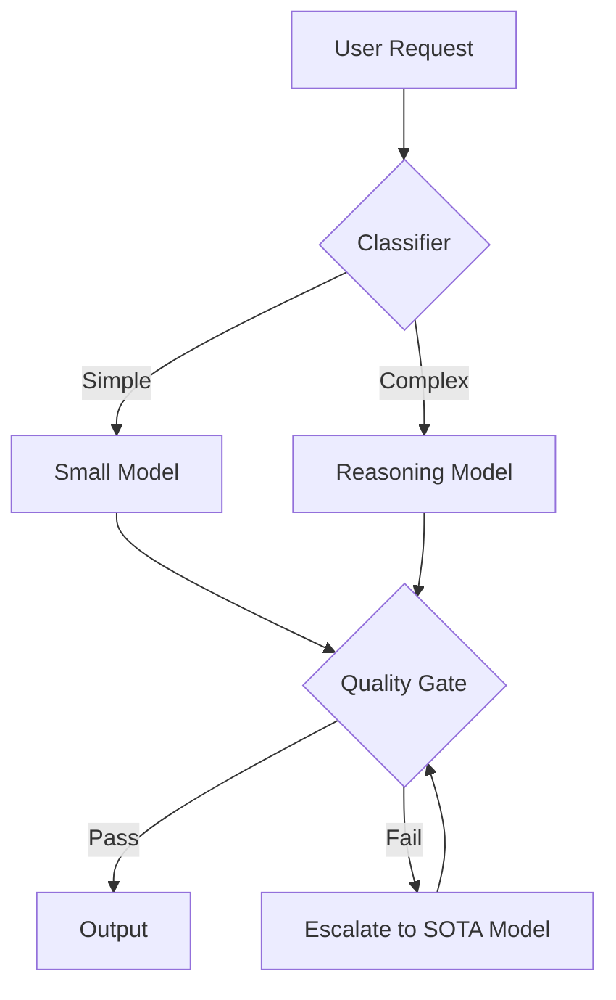

# Model Router & Evaluation Engine

> **Status:** Draft Specification (v1.0)
> **Source:** Orchestration/Copilot.md (Strategic Requirement #2)

## 1. Overview

The Model Router acts as a traffic controller, directing tasks to the most appropriate AI model based on complexity, cost, and latency requirements. It prevents "using a bazooka to kill a fly."

## 2. Routing Logic

### 2.1. Task Classification

Input prompt is analyzed to determine `TaskType`:

- **Code Generation**: Writing new complex logic (High complexity)
- **Refactoring**: Modifying existing code (Medium complexity)
- **Docs/Text**: Writing documentation (Low complexity)
- **Analysis**: Reviewing code or logs (High context window needed)

### 2.2. Routing Table (Default Policy)

| Task Type      | Preferred Model   | Fallback          | Rationale                             |
| -------------- | ----------------- | ----------------- | ------------------------------------- |
| **Architect**  | Claude 3.5 Sonnet | GPT-4o            | Best reasoning capabilities           |
| **CodeGen**    | Claude 3.5 Sonnet | GPT-4o / DeepSeek | High accuracy code generation         |
| **Refactor**   | GPT-4o            | Claude 3 Haiku    | Good instruction following, faster    |
| **Simple Fix** | GPT-4o Mini       | Llama 3 (Local)   | Low cost/latency                      |
| **Docs**       | Gemini 1.5 Pro    | GPT-3.5           | Large context window for reading repo |

## 3. Evaluation Loops (Self-Healing)

The router includes a feedback loop. If the chosen model fails the **Quality Gates**, the task is re-routed to a "stronger" model.



## 4. Configuration Schema (`router.json`)

```json
{
  "strategies": {
    "cost_optimized": {
      "default": "gpt-4o-mini",
      "complex": "claude-3-haiku"
    },
    "performance": {
      "default": "claude-3-5-sonnet",
      "complex": "o1-preview"
    },
    "privacy": {
      "default": "ollama:llama3",
      "complex": "ollama:deepseek-coder"
    }
  },
  "overrides": [
    { "keyword": "security", "model": "gpt-4o" },
    { "keyword": "test", "model": "claude-3-5-sonnet" }
  ]
}
```
