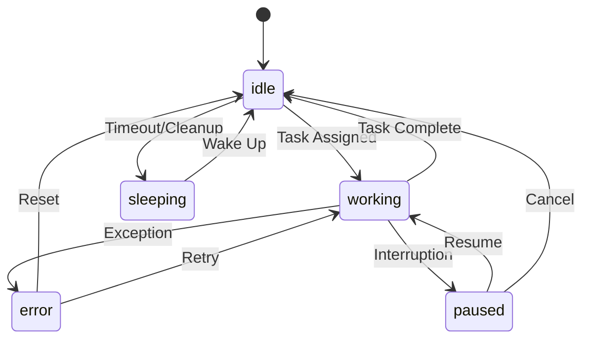
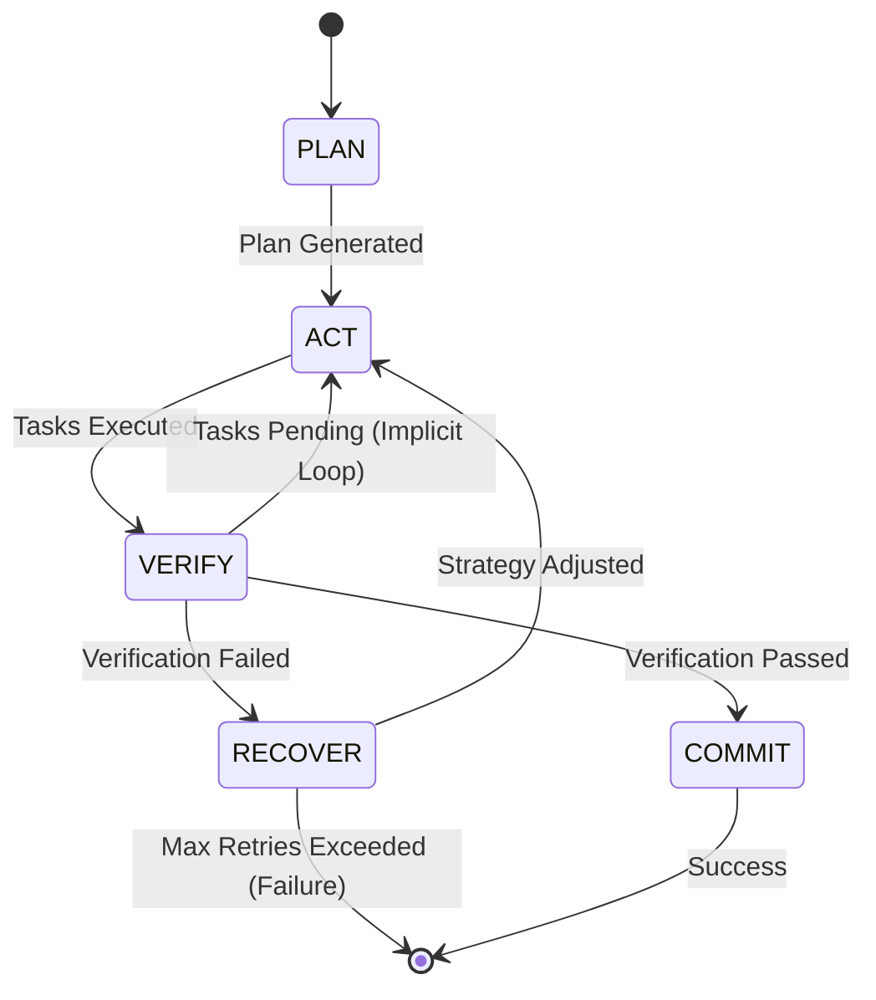

# Core Orchestration Dissection Report

## 1. Agent Execution Entry Points

### Primary Entry Point: `AgentOrchestrator` (`src/core/orchestration/index.js`)

The `AgentOrchestrator` class is the central nervous system for agent execution. It exposes the following methods:

1.  **`executeNexus(objective, options)`**: The main high-level entry point for autonomous agent loops. It delegates to `ralph-loop.js` (or `nexusExecutor`).
    *   **File:** `src/core/orchestration/index.js`
    *   **Line:** 148

2.  **`executeTask(task, options)`**: Executes a single atomic task using the AI Meta-Layer directly.
    *   **File:** `src/core/orchestration/index.js`
    *   **Line:** 179

3.  **`executeTool(name, args)`**: Executes an MCP tool directly.
    *   **File:** `src/core/orchestration/index.js`
    *   **Line:** 247

### Secondary Entry Points

*   **`UltraDexMetaLayer.process(objective, options)`**: Delegates to `agentOrchestrator.executeNexus`.
    *   **File:** `src/core/index.js`
    *   **Line:** 76

---

## 2. Agent Lifecycle State Machine

The system employs two distinct state machines: one for individual agent status (`AgentStateMachine`) and one for the execution loop (`Ralph Loop`).

### Agent Status Machine (`src/core/orchestration/agent-state.js`)



### Execution Loop Machine (`src/core/agents/ralph-loop.js`)

This loop governs the autonomous execution of an objective.



---

## 3. Race Conditions

### Critical Race Condition: Shared Task Graph

The `AgentOrchestrator` is a singleton instance that maintains a single `TaskGraph` (`this.tasks`). Multiple concurrent calls to `executeNexus` share this same graph without session isolation.

**File:** `src/core/orchestration/index.js`
**Line:** 62 (`this.tasks = new TaskGraph();`)

**Mechanism:**
1.  `executeNexus` (Session A) starts and adds tasks to `this.tasks`.
2.  `executeNexus` (Session B) starts and adds tasks to `this.tasks`.
3.  `ralph-loop.js` calls `runtimeOrchestrator.tasks.getReadyTasks()` (Line 84).
4.  `getReadyTasks` returns **ALL** ready tasks in the graph, regardless of which session created them.
5.  Session A might pick up and execute a task belonging to Session B, leading to context pollution and unpredictable behavior.

**Proof-of-Concept Code Snippet:**

```javascript
// reproduce_race.js
import { agentOrchestrator } from './src/core/orchestration/index.js';

async function demonstrateRaceCondition() {
  console.log('Starting concurrent executions...');
  
  // Simulate two concurrent tasks
  // Both will write to the SAME internal task graph
  const p1 = agentOrchestrator.executeNexus('Objective A: Build Frontend');
  const p2 = agentOrchestrator.executeNexus('Objective B: Build Backend');

  // Race condition: 
  // The Ralph Loop inside p1 will see tasks created by p2 in `getReadyTasks()`
  // because `TaskGraph` has no concept of session isolation.
  
  await Promise.allSettled([p1, p2]);
  
  console.log('Total Tasks in Shared Graph:', agentOrchestrator.tasks.tasks.size);
  // Expected result: Tasks from both objectives are mixed in the same graph.
}
```

---

## 4. Zombie Processes & Memory Leaks

### Zombie Logic: `AgentScheduler`
The `AgentScheduler` class is instantiated but **never started** or used by the main execution flow.

*   **File:** `src/core/orchestration/index.js`
*   **Line:** 74 (`this.scheduler = new AgentScheduler(this.options);`)
*   **Issue:** `scheduler.start()` is never called. `executeTask` bypasses the scheduler entirely and calls `this.ai.call` directly. The scheduler code is dead weight (zombie logic).

### Memory Leak: Unbounded `TaskGraph`
The `TaskGraph` accumulates tasks indefinitely. There is no mechanism to remove completed tasks or archive old sessions.

*   **File:** `src/core/orchestration/index.js`
*   **Line:** 29 (`addTask` adds to Map)
*   **Line:** 37 (`markComplete` updates status but keeps in Map)
*   **Impact:** The `this.tasks` Map will grow forever as the application runs, eventually causing an OOM (Out of Memory) crash.

### Memory Leak: Unbounded `AgentStateMachine` History
The `AgentStateMachine` records every state transition in an unbounded array.

*   **File:** `src/core/orchestration/agent-state.js`
*   **Line:** 37 (`this.stateHistory.get(agentId).push(...)`)
*   **Impact:** Long-running agents will accumulate infinite history records.

---

## 5. Governance Bypass

The system includes a robust `GovernanceManager`, but it is **completely disconnected** from the execution flow.

*   **File:** `src/core/governance/governance-manager.js` (Exists)
*   **File:** `src/core/orchestration/index.js` (Ignored)

**Bypass Mechanism:**
1.  `executeTool` (Line 247) receives a tool execution request.
2.  It calls `tool.handler(args)` **immediately** (Line 253).
3.  No policy check, no approval workflow, and no audit logging (via `GovernanceManager`) is performed.
4.  Effectively, all governance rules defined in `src/core/governance/` are bypassed.

**Proof-of-Concept:**

```javascript
// Bypass Demonstration
await agentOrchestrator.executeTool('delete_database', { force: true });
// This executes immediately. 
// A connected GovernanceManager would have blocked this based on the 'no-delete-production' policy.
```

---

## 6. Circular Dependencies

There is a runtime circular dependency between the Orchestrator and the Agent Loop.

1.  `AgentOrchestrator` (`index.js`) imports `ralph-loop.js` (dynamically) to run the loop.
2.  `ralph-loop.js` requires an instance of `AgentOrchestrator` to execute steps (`act`, `verify`).
3.  If `agentOrchestrator` is passed as `this` (which it is), they are tightly coupled. 
4.  While not a build-time cycle (due to dynamic import), it creates a runtime cycle where `Orchestrator` holds `Loop` which holds `Orchestrator`.

**Recommendation:** Decouple the Loop from the Orchestrator by defining a clear `ExecutionContext` interface that the Loop depends on, rather than the full Orchestrator instance.
