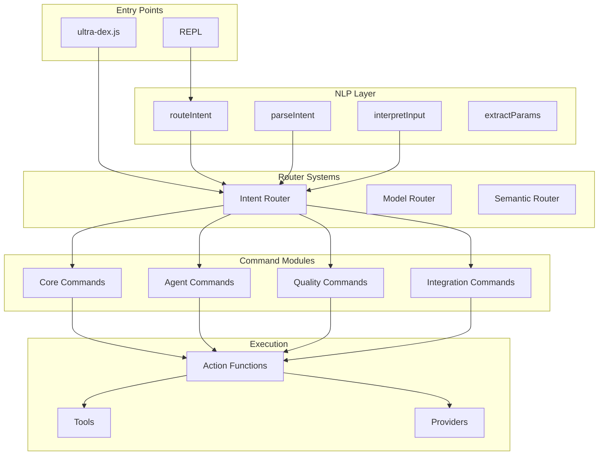
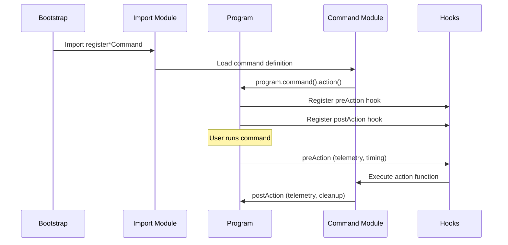
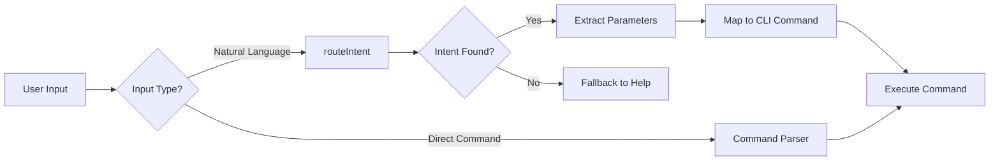

# NLP Intent Router - Dependency Map & Implementation Guide

**Generated:** March 27, 2026  
**Ultra-Dex Version:** 6.0.0  
**Report Location:** `upgrade/reports/nlp-dependency-map.md`

---

## Executive Summary

This report provides a comprehensive mapping of all CLI command entry points in the Ultra-Dex codebase and identifies optimal hook points for implementing an enhanced NLP intent router. The codebase already contains foundational NLP infrastructure that can be extended.

### Key Findings

1. **Primary CLI Entry Point:** `apps/cli/bin/ultra-dex.js` (Commander v13)
2. **Existing NLP Infrastructure:** `apps/cli/lib/nlp/router.js` with `routeIntent()` function
3. **150+ Registered Commands** across multiple command modules
4. **Multiple Router Systems:** NLP intent router, model router, semantic router
5. **Best Hook Point:** REPL layer and pre-action middleware

---

## 1. CLI Entry Points

### 1.1 Primary Bootstrap File

| File | Purpose | Framework |
|------|---------|-----------|
| `/apps/cli/bin/ultra-dex.js` | Main CLI entry point | Commander v13 |
| `/apps/cli/bin/ultra-dex-enhanced.js` | Enhanced CLI variant | Commander |
| `/apps/cli/bin/demo-pro.js` | Demo mode entry | Commander |

**Package.json Bin Field:**
```json
{
  "bin": {
    "ultra-dex": "./apps/cli/bin/ultra-dex.js"
  }
}
```

### 1.2 Entry Point Flow

```
┌─────────────────────────────────────────────────────────────────┐
│                    PROCESS START                                 │
│              (node apps/cli/bin/ultra-dex.js)                   │
└─────────────────────────────────────────────────────────────────┘
                              │
                              ▼
┌─────────────────────────────────────────────────────────────────┐
│  ENVIRONMENT SETUP                                               │
│  - FORCE_COLOR = '3'                                            │
│  - Check --doomsday flag                                        │
│  - Check --acp (Agent Client Protocol) mode                     │
│  - Initialize: monitoring, configManager, pluginManager,        │
│    governance, historyTracking                                  │
└─────────────────────────────────────────────────────────────────┘
                              │
                              ▼
┌─────────────────────────────────────────────────────────────────┐
│  UPDATE NOTIFIER CHECK                                           │
│  - Check for newer version                                      │
│  - Display update banner if available                           │
└─────────────────────────────────────────────────────────────────┘
                              │
                              ▼
┌─────────────────────────────────────────────────────────────────┐
│  COMMAND REGISTRATION                                            │
│  - Import all register*Command functions                        │
│  - Register 150+ commands with program                          │
│  - Configure custom help system                                 │
└─────────────────────────────────────────────────────────────────┘
                              │
                              ▼
┌─────────────────────────────────────────────────────────────────┐
│  ARGUMENT PARSING                                                │
│  - If no args: Start REPL (default)                             │
│  - If args: program.parseAsync(process.argv)                    │
└─────────────────────────────────────────────────────────────────┘
                              │
              ┌───────────────┴───────────────┐
              │                               │
              ▼                               ▼
┌─────────────────────────┐     ┌─────────────────────────┐
│      REPL MODE          │     │    COMMAND MODE         │
│  (no arguments)         │     │  (with arguments)       │
│  - readline interface   │     │  - Execute registered   │
│  - Session persistence  │     │    command action       │
│  - Slash commands       │     │  - Run pre/post hooks   │
└─────────────────────────┘     └─────────────────────────┘
```

---

## 2. Command Registration Architecture

### 2.1 Registration Pattern

All commands follow a consistent registration pattern:

```javascript
// apps/cli/lib/commands/<command>.js
export function register<CommandName>Command(program) {
  program
    .command('<command-name> [arguments]')
    .description('Command description')
    .option('-f, --flag', 'Option description', defaultValue)
    .action(async (args, options) => {
      // Command implementation
    });
}
```

### 2.2 Command Categories & Count

| Category | Count | Example Commands |
|----------|-------|------------------|
| **Core Development** | 25 | `init`, `generate`, `build`, `code-gen`, `scaffold` |
| **Agent/Swarm** | 15 | `swarm`, `agents`, `daemon`, `ralph`, `nexus` |
| **Quality/Verification** | 20 | `audit`, `verify`, `check`, `quality`, `review` |
| **Project Management** | 18 | `plan`, `status`, `dashboard`, `monitor`, `ledger` |
| **Integration** | 15 | `github`, `jira`, `notion`, `trello`, `mcp` |
| **AI/ML** | 12 | `brain`, `memory`, `rag`, `vector-search`, `neuro-plan` |
| **DevOps** | 12 | `serve`, `deploy`, `docker`, `k8s`, `cicd` |
| **Security** | 10 | `security`, `gate`, `governance`, `credentials`, `vault` |
| **Utilities** | 20 | `help`, `config`, `setup`, `upgrade`, `telemetry` |
| **Advanced** | 15 | `autonomous`, `pipeline`, `batch`, `forge`, `vibe` |

---

## 3. Existing NLP Infrastructure

### 3.1 NLP Intent Router (`apps/cli/lib/nlp/router.js`)

**Current Implementation:**

```javascript
export function routeIntent(input) {
  // Three-tier priority matching:
  // 1. Direct command names (exact match)
  // 2. Contextual phrase matching
  // 3. Keyword matching with semantic scoring
  
  const intents = [
    { intent: 'init', keywords: ['init', 'new project', 'create project', ...] },
    { intent: 'generate', keywords: ['generate', 'plan', 'idea', ...] },
    { intent: 'build', keywords: ['build', 'develop', 'implement', ...] },
    { intent: 'agents', keywords: ['agent', 'specialist', 'who', ...] },
    { intent: 'swarm', keywords: ['swarm', 'pipeline', 'autonomous', ...] },
    { intent: 'status', keywords: ['status', 'how is', 'progress', ...] },
    { intent: 'dashboard', keywords: ['dashboard', 'gui', 'web', ...] },
    { intent: 'doctor', keywords: ['doctor', 'fix system', 'diagnose', ...] },
    { intent: 'help', keywords: ['help', 'what can', 'how to', ...] },
    { intent: 'audit', keywords: ['audit', 'security', 'review', ...] },
    { intent: 'serve', keywords: ['serve', 'mcp', 'server', ...] },
    { intent: 'exit', keywords: ['exit', 'quit', 'bye', ...] },
    { intent: 'sync', keywords: ['sync', 'synchronize', 'update state', ...] },
    { intent: 'voice', keywords: ['voice', 'speech', 'talk', ...] },
    { intent: 'review', keywords: ['review', 'check', 'look at', ...] },
    { intent: 'search', keywords: ['search', 'find', 'look for', ...] },
  ];
  
  // Returns: intent string or null
}

export function extractParams(intent, input) {
  // Named entity extraction for: projectName, stack, file, component
}

export function getIntentConfidence(input) {
  // Returns: { intent, confidence: 0.0-1.0 }
}
```

**Features:**
- Synonym mapping for semantic understanding
- Fuzzy string matching (Levenshtein-inspired)
- Semantic similarity scoring
- Confidence scoring

### 3.2 Intent Parser (`apps/cli/lib/nlp/intent-parser.js`)

Regex-based pattern matching with `INTENT_MAP` for direct command routing.

### 3.3 Vibe Interpreter (`apps/cli/lib/vibe/interpreter.js`)

Detects mode (create, modify, explain, debug), extracts file paths and intents.

### 3.4 Model Router (`apps/cli/lib/ai/model-router.js`)

Task-based AI model selection with task classification, model capability matching, cost optimization, and fallback chains.

### 3.5 NL Pipeline (`apps/cli/lib/nl-pipeline/index.js`)

Full NL-to-code pipeline: parse request → generate plan → execute agents → run tests → deploy.

---

## 4. Dependency Graph

### 4.1 High-Level Architecture



### 4.2 Command Registration Flow



### 4.3 NLP Intent Flow



---

## 5. Recommended Hook Points for NLP Intent Routing

### 5.1 Primary Hook Points (Recommended)

#### **Hook Point 1: REPL Input Handler**
**Location:** `apps/cli/lib/repl/index.js` (Lines 125-145)

**Why This Location:**
- Default entry point when no args provided
- Interactive session context available
- Can maintain conversation history
- Already handles user input parsing

**Implementation:**
```javascript
if (input.startsWith('/')) {
  await handleSlashCommand(input);
} else {
  // NLP Intent Routing Hook
  const { routeIntent, extractParams } = await import('../nlp/router.js');
  const intent = routeIntent(input);
  
  if (intent) {
    const params = extractParams(intent, input);
    const confidence = getIntentConfidence(input);
    
    if (confidence.confidence > 0.7) {
      // Auto-execute high-confidence intents
      await executeIntentCommand(intent, params);
    } else {
      // Confirm low-confidence intents
      await confirmAndExecute(intent, params, confidence);
    }
  } else {
    replContext.context.lastResult = input;
  }
}
```

---

#### **Hook Point 2: Pre-Action Middleware**
**Location:** `apps/cli/bin/ultra-dex.js` (Lines 256-275)

**Why This Location:**
- Intercepts ALL commands
- Can log intent mismatches for training
- Non-intrusive (doesn't change behavior)
- Good for analytics and improvement

**Implementation:**
```javascript
program.hook('preAction', async (thisCommand, actionCommand) => {
  commandStart = Date.now();
  
  // NLP Intent Analysis Hook
  const rawInput = process.argv.slice(2).join(' ');
  const { routeIntent } = await import('../lib/nlp/router.js');
  const intent = routeIntent(rawInput);
  
  if (intent && intent !== actionCommand.name()) {
    monitoring.recordEvent('nlp_intent_mismatch', {
      parsed: actionCommand.name(),
      detected: intent,
      input: rawInput,
    });
  }
  
  // ... existing telemetry setup
});
```

---

#### **Hook Point 3: Command Not Found Handler**
**Location:** `apps/cli/bin/ultra-dex.js` (Add after line 486)

**Why This Location:**
- Catches invalid commands
- Provides helpful suggestions
- Improves UX for natural language input

**Implementation:**
```javascript
program.on('command:*', () => {
  const rawInput = process.argv.slice(2).join(' ');
  
  const { routeIntent } = await import('../lib/nlp/router.js');
  const intent = routeIntent(rawInput);
  
  if (intent) {
    console.log(chalk.yellow(`Did you mean: ultra-dex ${intent}?`));
    console.log(chalk.gray(`Original input: "${rawInput}"`));
    console.log(chalk.gray(`Detected intent: "${intent}"\n`));
  } else {
    console.error(chalk.red(`Unknown command: ${process.argv.join(' ')}`));
  }
  process.exit(1);
});
```

---

#### **Hook Point 4: Kernel Agent Integration**
**Location:** `apps/cli/lib/kernel/agent.js` (Lines 78-102, 323-328)

**Why This Location:**
- Already has NLP integration
- Offline mode fallback
- Can leverage AI for complex parsing

---

### 5.2 Secondary Hook Points

| Location | File | Purpose | Priority |
|----------|------|---------|----------|
| **Vibe Mode** | `apps/cli/lib/vibe/interpreter.js` | Natural language file operations | Medium |
| **Forge Command** | `apps/cli/lib/commands/forge.js` | NL-to-code pipeline | Medium |
| **Autonomous Mode** | `apps/cli/lib/commands/autonomous.js` | Goal-based execution | High |
| **Brain Sync** | `apps/cli/lib/commands/brain.js` | Context-aware suggestions | Medium |
| **Suggest Command** | `apps/cli/lib/commands/suggest.js` | Command recommendations | Low |

---

## 6. Implementation Considerations

### 6.1 Intent Expansion Requirements

Current NLP router supports 16 intents. Recommended expansion to 50+:

```javascript
const EXPANDED_INTENTS = {
  // Existing (16)
  'init', 'generate', 'build', 'agents', 'swarm', 'status', 'dashboard',
  'doctor', 'help', 'audit', 'serve', 'exit', 'sync', 'voice', 'review', 'search',
  
  // Recommended Additions
  'deploy', 'docker', 'k8s', 'test', 'lint', 'format', 'commit',
  'push', 'pull', 'merge', 'branch', 'rebase', 'cherry-pick',
  'config', 'setup', 'install', 'uninstall', 'update', 'upgrade',
  'logs', 'monitor', 'profile', 'benchmark', 'debug', 'trace',
  'security', 'scan', 'vault', 'encrypt', 'decrypt', 'auth',
  'plugin', 'marketplace', 'template', 'scaffold', 'export', 'import',
  'memory', 'context', 'session', 'history', 'undo', 'redo',
  'team', 'collaborate', 'share', 'publish', 'billing', 'usage',
};
```

### 6.2 Parameter Extraction Enhancement

```javascript
const ENHANCED_PATTERNS = {
  projectName: /(?:called|named|project|app)\s+([a-z0-9-_]+)/i,
  stack: /(?:using|with|stack)\s+([a-z0-9-]+)/i,
  file: /(?:file|in)\s+([a-z0-9./-]+\.[a-z]+)/i,
  component: /(?:component|page|api)\s+([A-Za-z0-9]+)/i,
  directory: /(?:dir|directory|folder|path)\s+([a-z0-9./_-]+)/i,
  branch: /(?:branch)\s+([a-z0-9._/-]+)/i,
  provider: /(?:provider|model|ai)\s+([a-z0-9-]+)/i,
  port: /(?:port)\s*(\d+)/i,
  url: /(?:url|endpoint|api)\s+(https?:\/\/[^\s]+)/i,
  count: /(?:count|number|limit|max)\s*(\d+)/i,
  format: /(?:format|as)\s+(json|yaml|md|html|text)/i,
};
```

### 6.3 Confidence Thresholds

| Confidence | Action |
|------------|--------|
| 0.9 - 1.0 | Auto-execute without confirmation |
| 0.7 - 0.9 | Execute with brief confirmation |
| 0.5 - 0.7 | Show suggestions, require confirmation |
| < 0.5 | Show help, don't execute |

---

## 7. File Reference Summary

### 7.1 Core NLP Files

| File Path | Purpose | Lines |
|-----------|---------|-------|
| `/apps/cli/lib/nlp/router.js` | Intent routing | ~250 |
| `/apps/cli/lib/nlp/intent-parser.js` | Regex parsing | ~30 |
| `/apps/cli/lib/vibe/interpreter.js` | Vibe mode NLP | ~100 |
| `/apps/cli/lib/nl-pipeline/index.js` | NL pipeline | ~80 |

### 7.2 Entry & Integration Files

| File Path | Purpose | Lines |
|-----------|---------|-------|
| `/apps/cli/bin/ultra-dex.js` | Main entry point | ~500 |
| `/apps/cli/lib/repl/index.js` | REPL interface | ~200 |
| `/apps/cli/lib/kernel/agent.js` | Agent execution | ~350 |
| `/apps/cli/lib/ai/model-router.js` | Model selection | ~400 |

---

## 8. Implementation Roadmap

### Phase 1: Foundation (Week 1)
- [ ] Expand intent dictionary to 50+ commands
- [ ] Add parameter extraction patterns
- [ ] Implement confidence scoring
- [ ] Add command-not-found handler

### Phase 2: Integration (Week 2)
- [ ] Hook into REPL input handler
- [ ] Add pre-action NLP logging
- [ ] Implement context-aware routing
- [ ] Add caching layer

### Phase 3: Enhancement (Week 3)
- [ ] Add conversation history awareness
- [ ] Implement multi-turn intent clarification
- [ ] Add learning from corrections
- [ ] Integrate with model router

### Phase 4: Polish (Week 4)
- [ ] Add comprehensive tests
- [ ] Performance optimization
- [ ] Documentation
- [ ] User feedback collection

---

## 9. Conclusion

The Ultra-Dex CLI has a solid foundation for NLP intent routing with:
- **Existing infrastructure** in `apps/cli/lib/nlp/router.js`
- **150+ commands** ready for natural language access
- **Multiple hook points** identified for integration
- **Clear implementation path** with minimal disruption

**Recommended Starting Point:** Begin with Hook Point 1 (REPL Input Handler) as it provides immediate user value with minimal risk, then expand to other hook points iteratively.

---

*Report generated by Ultra-Dex CLI Architecture Analysis*
